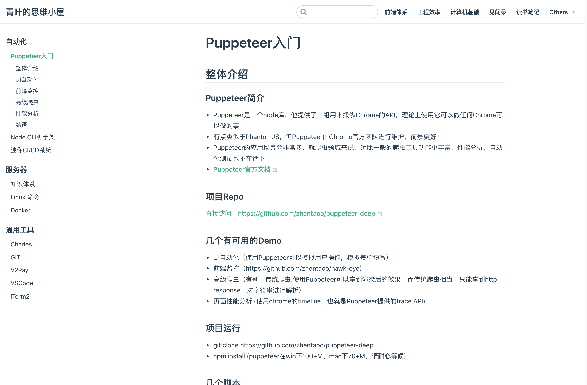

# 青叶的思维小屋

## 工程运行

- 安装依赖：lerna bootstrap
- 本地运行：npm run dev
- 首次次线上运行：lerna run build

## 工程介绍
- Mind: [zhentaoo，个人 Web 技术博客、见闻思考、读书笔记](./packages/mind/README.md)
- Qyezi: [qyezi，千页字，读书笔记]
- CICD: [项目自动部署 Node 服务](./packages/ci-cd/README.md)
- nginx-confg：个人服务器nginx配置

## 网站概览
### https://www.zhentaoo.com/blog/Puppeteer.html

