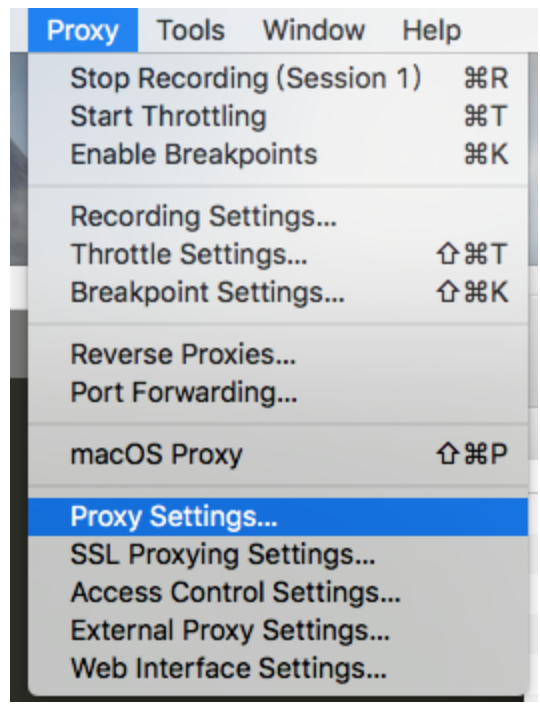
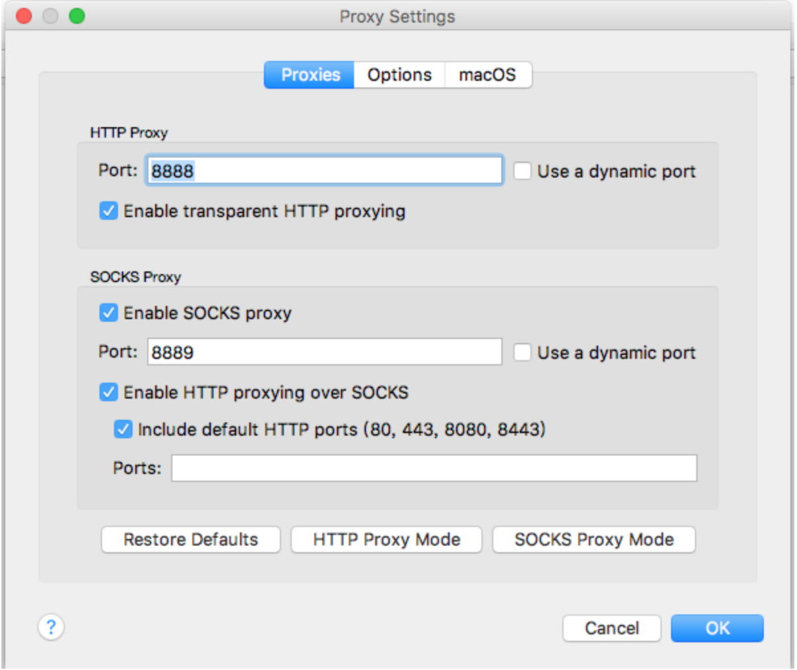
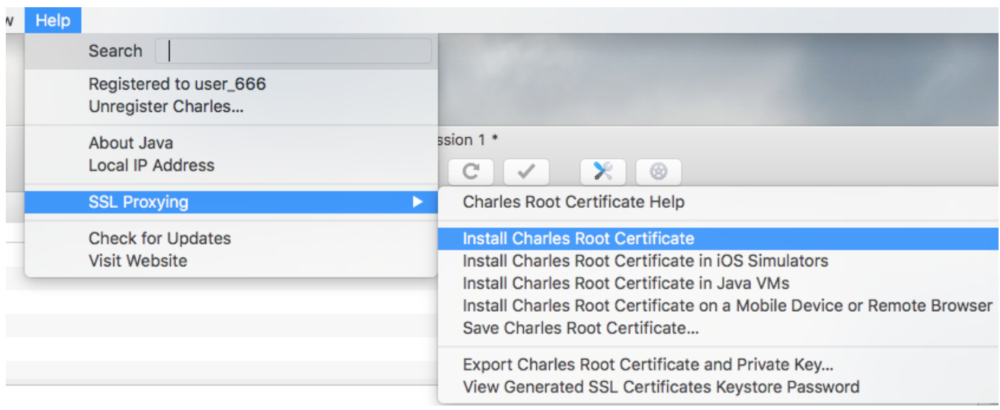
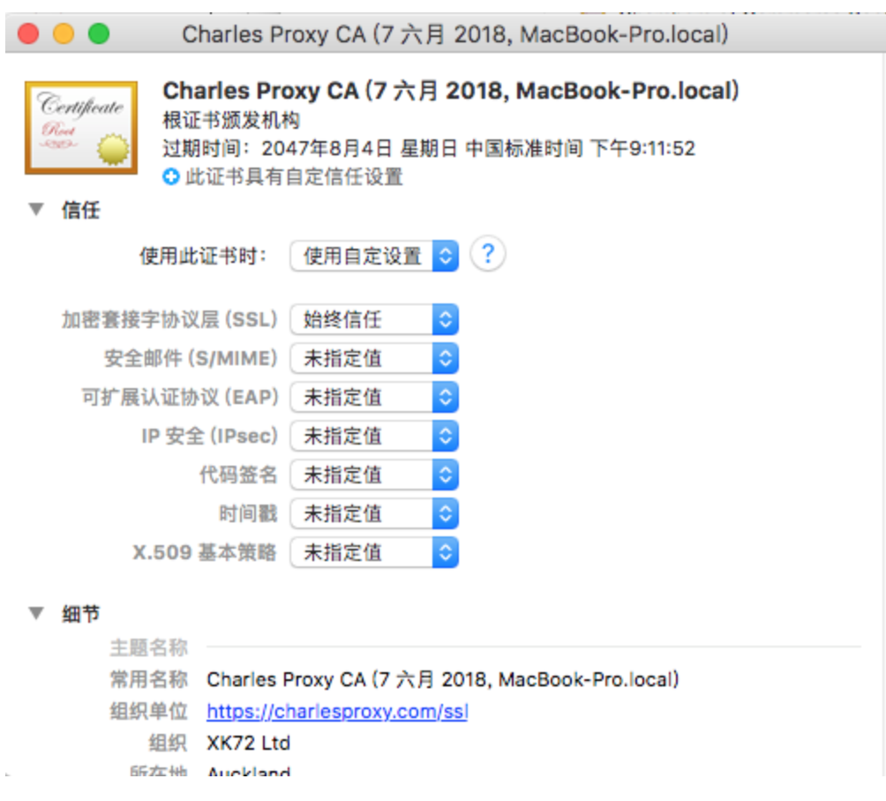
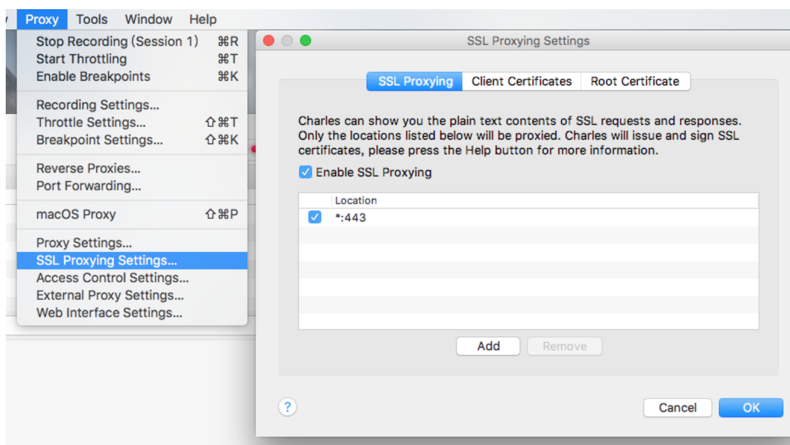
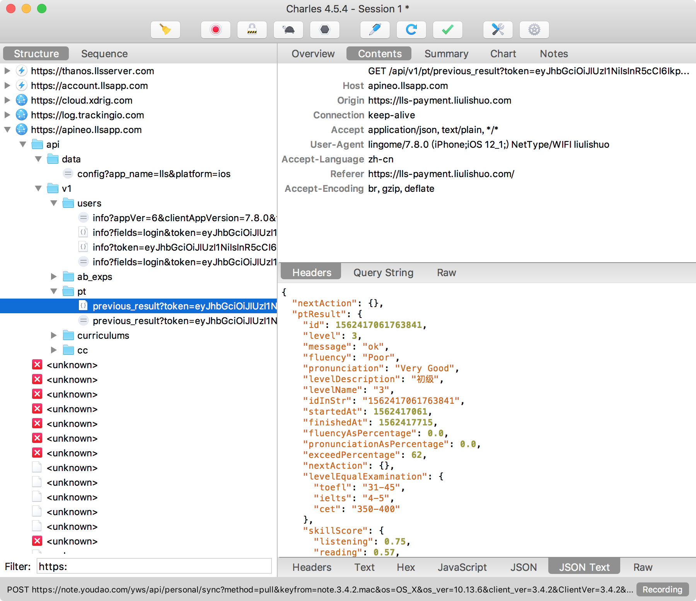

# Charles

## MAC 系统配置
1. 配置HTTP代理，这步与抓取HTTP请求是一样的

2. 选择在8888端口上监听，然后确定，够选SOCKS proxy。

3. 安装电脑端根证书：
首先在charles的 Help选项 选择 SSL Proxyings选项 再选择 Install Charles Root Certificate选项

4. 在Mac钥匙串中信任该证书：

5. 配置SSL代理：

## IOS设置代理

1. 确保手机与电脑在同一局wifi中.

2. IOS 设置--点击wifi后面的(感叹圈) -- 往下滑 -- 配置代理 -- 手动 -- 输入安装Charles的电脑的网络地址，端口填8888。

3. 这时候访问网络，charles会弹出询问弹框，点击allow。

4. 浏览器输入chls.pro/ssl，安装证书到本地。

5. 在手机`设置 -> 通用 -> 关于本机 -> 证书信任设置` 中点击信任。

## 最终效果
可以在Mac上抓到IOS 流利说ap的api信息
