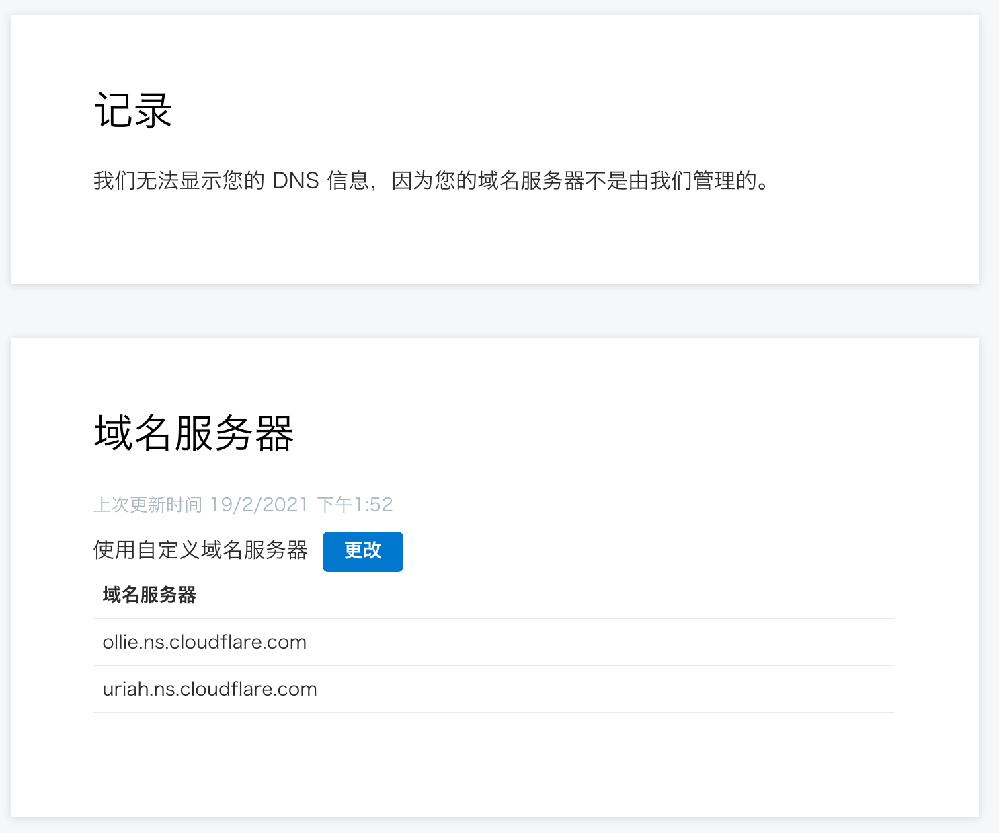
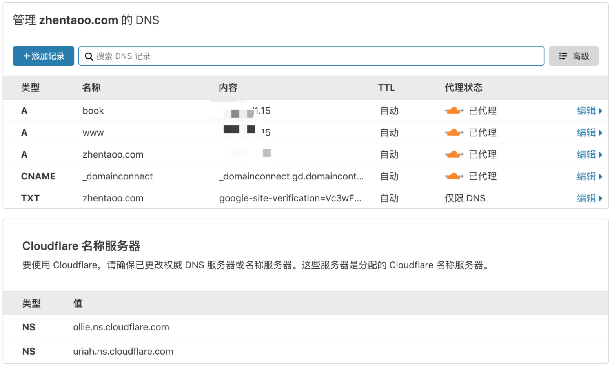

# Domain

## Godaddy域名商
作为一个程序员当然需要一个自己的站点，建议到海外的godaddy购买域名，省去国内备案的诸多限制；

GoDaddy是一家提供域名注册和互联网主机服务的美国公司，服务产品涉及域名主机领域基础业务：域名注册、虚拟主机、VPS、独立主机，以及域名主机领域的衍生业务：独立IP、SSL证书、网站建设、邮箱、相册、速成网站、加速搜索引擎收录、网站分析等。

**官网：https://dcc.godaddy.com/**

接下来就靠你自己去购置一个域名了

## Cloudflare CDN商
随着互联网的普及，网站安全性非常重要，如果只是HTTP网站很容易被黑、被运营商加盐，而且Chrome很快就不再支持HTTP站点了，所以升级HTTPS十分必要；

作为建设网站的人，当然希望全球各地的人都能访问到自己的站点，但是个人服务器只有一台，其他地区的人访问很慢该怎么办？

为了解决这两个问题：“安全”+“速度”，建议直接在https://dash.cloudflare.com 加一下个人站，帮你加速的同时也能给你提供https服务！

需要到godaddy管理后台，把域名服务器更改到cloudflare

再到cloudflare 查看自己的域名可以发现代理成功

然后你就可以免费享受cdn+https服务了！

