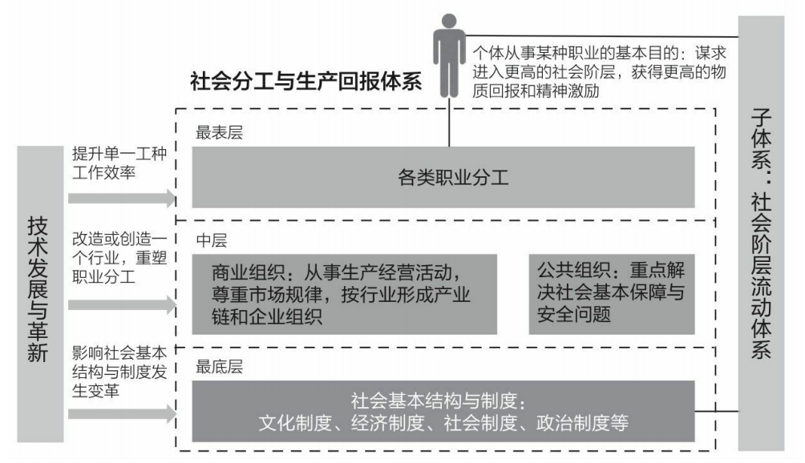
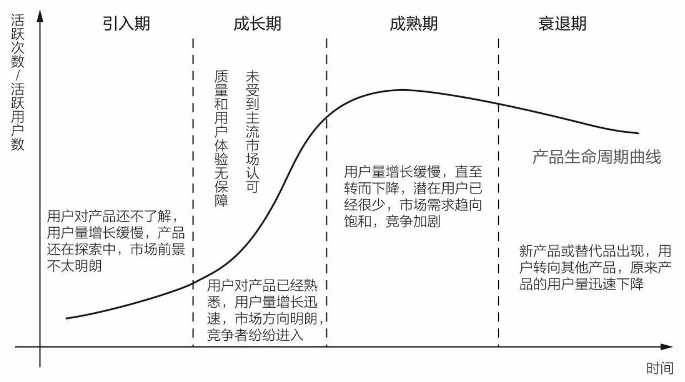
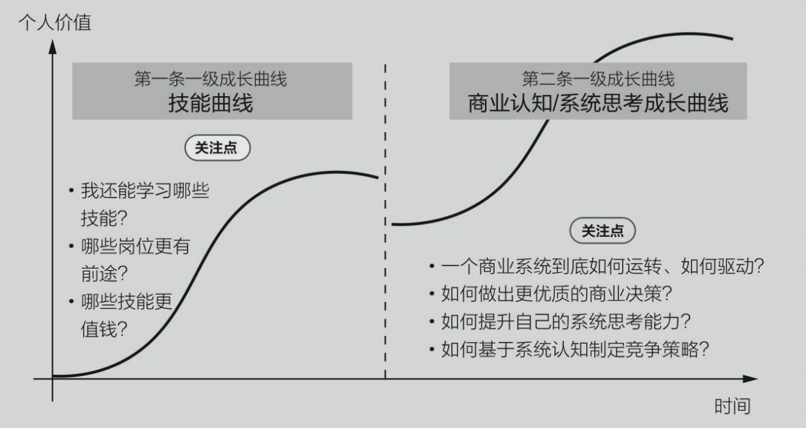
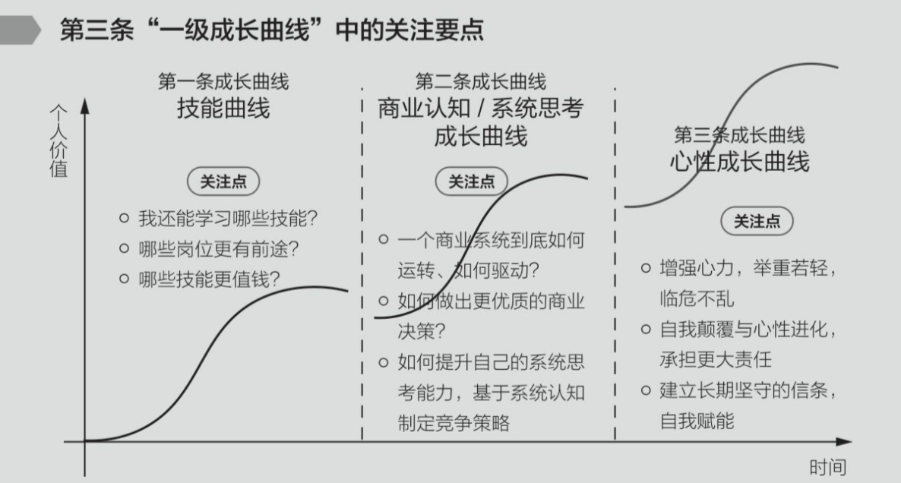
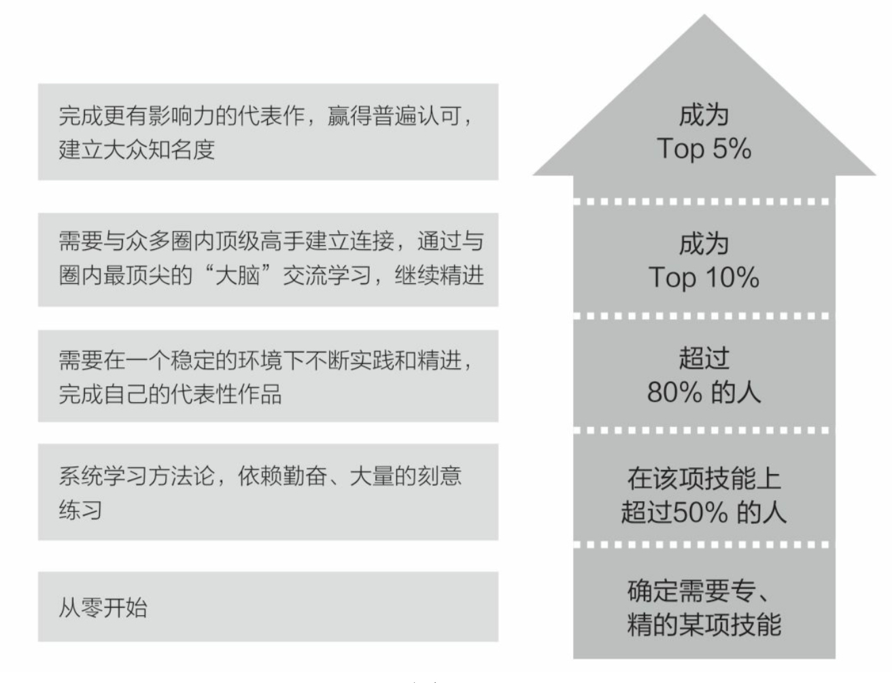
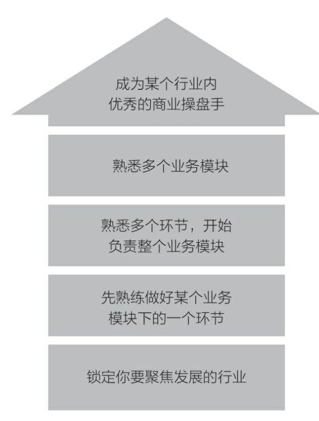
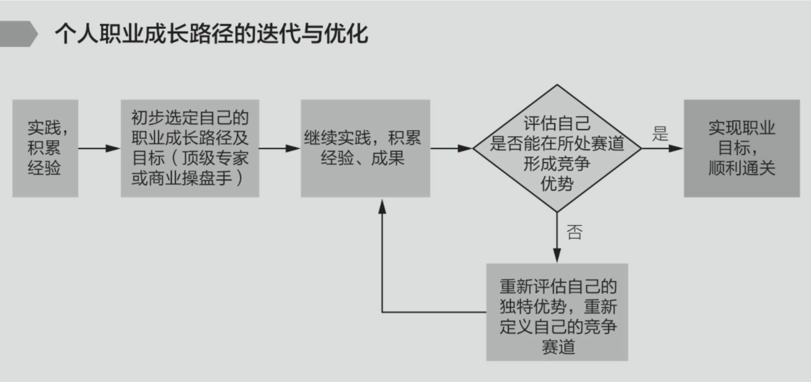

# 非线性成长

## 世界的真相

在整个社会分工与生产回报体系中，各类职业分工本质上是整个体系中的一个组成部分，也是整个体系中离我们最近、最表层、最可见的部分。 而一个社会分工与生产回报体系中，到底会出现哪些：

在三层结构的最底层，是社会基本结构与制度，如我们的经济制度 等，这一层的变革，例如一个新的政策产生或新的制度的确立，可能会 催生出许多新的组织和行业，也会使许多原有的组织和行业消亡。

而整个体系的中层，则是各类组织——要知道，一个职业岗位，一
定是服务于某个组织的。而我们最常见的组织分为两类，一类是商业组 织，主要从事生产经营活动，它们按行业组合在一起，形成一条一条的 产业链；另一类则是公共组织，如公共教育医疗机构等，这里，某一类 组织的商业经营模式或是运营方式发生了变化，也会导致一些职业的工 作内容、方法等发生巨大的变化。

而最表层，才是我们经常谈论的各类职业分工，在下面两层结构相 对稳定的情况下，这一层的变化最多不过是工作方法的优化和改善。但当下面两层结构剧烈变化时，则这一层的变化也必然非常动荡，其中充 满了无数职业的演化、升级、更替和消亡。

而在这个大体系的身旁，技术发展与革新会是一种非常重要的影响 因素，对于整个大体系的每一部分都可能产生某种或大或小的影响，从 而引发职业市场或职业环境中的一系列变化，导致许多新旧职业的更 替，以及原有职业的进化。

## 非线性曲线
### 一般曲线
新陈代谢是宇宙间普遍永远不可抵抗的规律，一般事物都会经过下列几个生命周期：

### 个人成长的两条曲线
一个人从依赖走向独立的过程即第一条曲线：在这条曲线上，需要不断提升自己的专业能力、选择社会岗位、发掘职位潜力；

从独立走向互相依赖的过程即第二条曲线：在这条曲线上，需要建立系统性认知，学会制定系统性战略；

### 第三条曲线
第三条曲线即心性曲线：在通往更大领域的路上，会有形形色色的事物扰乱你的心智，什么是对什么是错？什么是成功什么是失败？成功如何失败又如何？
巨大的虚无主义？你所坚持的、你所努力的、你所喜欢厌恶的都会遭到质疑，如何在这样一个极端自由的世界继续前进，心性的历练将持续一生

## 职场通关的两种方法
### 成为领域顶级专家：top5

### 成为优秀商业操盘手

## 通关不了怎么办？
职场通关成为Top专家或者商业操盘手固然很好，但现实是绝大多数人卡在通关卡口，这种情况要怎么办？只要耐心积累，去调整你的赛道，很大可能会走上成功
