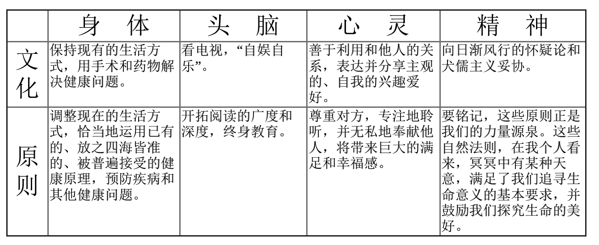

# 高效能人士的七个习惯

## 七个习惯概览图

## 个人领域成功
### 1.积极主动
积极主动即采取主动，为自己过去、现在和未来的行为负责，并依据原则和价值观，而不是根据情绪和外在环境来下决定。主动积极的人是变革的催生剂，他们放弃 被动的受害者的角色，不自卑，不怨怼，发扬人类四项独特的禀赋：自知、良知、想像力和自主意志，积极主动，以由内而外的方式来创造改变。

### 2.以始为终
所有事物都经过两次创造，先是在脑海里酝酿，其次才是实质的创造。个人、家庭、团队和组织在做任何计划时，均先拟出愿景和目标，并据此塑造未来，全心专注 于自己最重视的原则、价值观、关系及目标之上。领导工作的核心就是在共有的使命、愿景和价值观的基础之上，创造出一种文化。

### 3.要事第一
要事即实质的创造，是梦想(你的目标、愿景、价值观及要事处理顺序)的组织和时间。次要的事不必摆在第一，要事也不能放在第二。无论迫切性如何，个人及组织均针对要事而 来，重点是，把要事放在第一顺位。

## 公众领域成功

### 4.双赢思维
双赢思维是一种基于互敬、寻求互惠的思考框架与心意，目的是争取更丰盛的机会、财富及资源，而不是你死我活的敌对竞争。双赢既非损人利己(赢输)，亦非损 己利人(输赢)。工作伙伴或家庭成员则更要从互赖式的角度来思考问题(‘我们’而非‘我’)。双赢思维鼓励我们解决问题的同时，还要求协助对方找到互惠的 解决方法，是一种资讯、力量、认可及报酬的分享。

### 5.知己解彼
当我们舍弃焦躁心，改以同情心去聆听别人，便能开启真正的沟通，增进彼此的了解。对方获得了解后，会觉得受到尊重和认可，进而卸下心防，坦诚面对，双方相互的了解也就更加顺畅自然。彼此需要仁慈心；知己需要勇气，能平衡，则可大幅提升沟通的效率。

### 6.统合综效
统合综效谈的是创造第三种选择，既非按照我的方式，亦非遵循你的方式，而是采取远胜过个人之见的第三种方案。这是互相尊重的成果——不但是彼此理解，甚至 是称许、欣赏对方解决问题及掌握机会的智慧。个人的力量是团队和家庭统合综效的基础，能使整体获得1+1>2的成效。实践统合综效的人际关系和团队 会扬弃敌对的态度(1+1=1/2)，不以妥协为目标(1+1=1或1/2)，也不仅止于合作(1+1=2)，追求的是创造式的合作(1+1=3或更 多)。

## 自我提升和完善
### 7.不断更新
不断更新谈的是，如何在四个生活面向(身体、精神、智力、社会/情感)中，不断更新自己，这个习惯提升了其他六个习惯的实施效率。对个人及组织而言，不断地更新及不断地改善，使之不致呈现老化及疲态，并迈向新的成长路径。

#### 其他
最近看的几本书《非线性成长》《第二曲线》《高效能人士的七个习惯》《习惯的力量》冥冥中有种联系～
