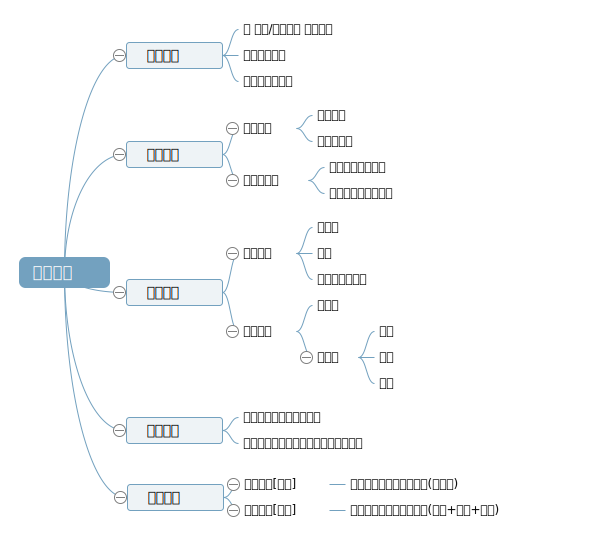

# 如何高效阅读

## 读书的问题
大家可能都有过这样的感受：

1. 读书当时很有感触，但过段时间内容就忘的差不多了，需要花很多精力才能捡起；
2. 读一本书需要花很长时间，效率太低；
3. 书本内容我都记住了，但是没法对我的工作生活产生帮助，没什么价值；

下面是一套高效阅读法，总结下来就是：
**有目标、有脉络、有重点、有沉淀、有输出**

## 高效阅读法

https://naotu.baidu.com/file/b41bdc24c24fee4805213e80714d7ed6

