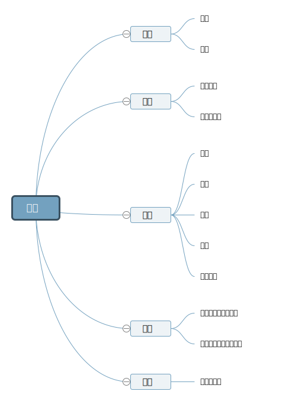

# 普通心理学

## 思维导图

## 认知
人获得知识或应用知识／信息加工的过程， 包括感觉、知觉、记忆、想象、思维、语言，统称为认知过程
例子：看到光，听到水声，闻到味道，

## 情绪
人在加工外界输入信息时，不仅会认识事物的客观性质， 还会产生对这种事物的主观体验、感受，这就是情绪。 对情绪进行再评价
例子：看到美女产生爱意，看到大便会感到恶心

## 动机，需求
动机指推动人的活动，并朝着某一目标的内部驱动力。
衣食住行性，安全，情感归属，尊重，自我超越
例子：喜欢漂亮妹子，那么想上这个妹子，就是把自己变得优秀、有钱、帅气的驱动力

## 能力
定义：掌握知识、技能的速度与质量（广度，深度）
分类：模仿、创造；流体、晶体；认知，操作，社交；情绪

## 个体心理特性
人的心里特性有些是稳定的，有些是偶然的。
这种在个体身上经常表现出来的、本质的、稳定的心里特性称为个体心里特性：能力、气质、性格