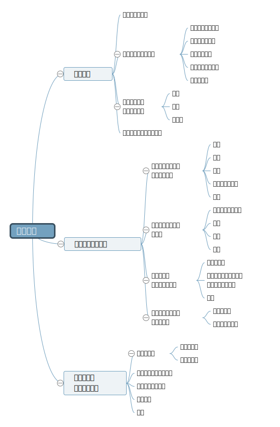

# 乌合之众

## 导言

- 除了别人强加给群体的意见，他们并不能坚持自己的意见；
- 探究人们行为的动机，就像研究植物、矿物属性一样具有乐趣;
- 下面对于群体习惯的研究仅仅是一个简单的总结，除了一点建议性的言论外，没必要对他们抱有过多的期望；

## 群体心理

1. 群体普遍特征

   - 群体构成
     - 群体中的个体分散在不同的地点
     - 个体自觉让个性消失
     - 感情和思想朝既定方向发展
   - 普遍特征
     - 群体的智力低于个体
     - 群体受无意识支配
     - 群体易于无畏和犯罪
   - 形成原因
     - 群体间的暗示
     - 行为受本能支配
     - 感情和行为容易受传染

2. 群体的感情和道德观

   - 群体的情感特征
     - 急躁、冲动、易变
     - 易受暗示和轻信
     - 情绪夸张、单纯
     - 偏执、专横、保守
   - 群体的道德特征
   - 群体中的个体有“法不责众”的意识
   - 群体有时比独处时高尚，有时更低劣

3. 群体的观念、推理、想象力

   - 群体的观念
     - 观念只有足够简单才能易于被群体接受
     - 观念能否影响人与其对错、崇高与否无关
   - 群体的推理能力
     - 群体的推理能力低下
     - 群体不受理性影响
     - 群体接受的相似性只存在于表面
   - 群体的想象力
     - 群体的想象力及其强大
     - 群体的形象思维，与逻辑无关
     - 群体容易感动于神奇的事物

4. 群体信仰采用的宗教形式

## 群体的意见和信念

1. 间接成因

   - 种族：种族的影响至关重要
   - 传统：传统是种族精神的综合性反应
   - 时间：信念的建立需要时间，信念的毁灭也需要时间
   - 政治与社会制度：政治与社会制度由民族性质决定
   - 教育：教育会影响群众的错误观念

2. 直接成因

   - 形象、词语和口号：词语和口号展现的力量尤其所唤起的形象决定
   - 幻觉：幻觉存在于所有文明的起源中，相对于真理，群体更喜欢幻觉
   - 经验：经验可以让真理在群体心中扎根，说服群体需要付出经验和代价
   - 理性：理性对群体几乎没有任何作用，无意识的情感是影响群体的主要因素

3. 群体领袖和说服他们的方法

   - 特征：群体都有服从领袖的本能，只有领袖能让他们有信仰
   - 手段：群体不是思想者，而是行动者；传染从社会下层向上层传播

4. 群体的信念和意见的变化范围
   - 牢固的信念：一些最普遍的信念是最不容易改变的
   - 多变：如果群体的意见不是从普遍的信念中得来，那么它便会容易改变

## 不同群体的分类及其特点

1. 异质性群体
    - 无名称的群体：如街头群体
    - 有名称的群体：如议会、陪审团
2. 同质性群体
    - 派别：政治派别、宗教派别
    - 身份团体：军人、僧侣、老公
    - 阶级：中产阶级、农民阶级
3. 所谓的犯罪群体
    - 群体在犯法时也许并不是心理犯罪
    - 群体行为具有绝对的无意识性
4. 刑事案件的陪审团
    - 陪审团的判决独立于他们的人员分布
    - 愿意屈从于威望、更容易被说服
    - 注重情感，对激情犯 易表现出宽容
5. 选民群体
    - 选民容易被控制
    - 没有逻辑推理能力
    - 没有批判精神，易怒、轻信
6. 议会
    - 领导的权威对议员的影响很大
    - 议会群体易受暗示、具有局限性
    - 有着难以改变的意见和易变的意见

## 思维导图

