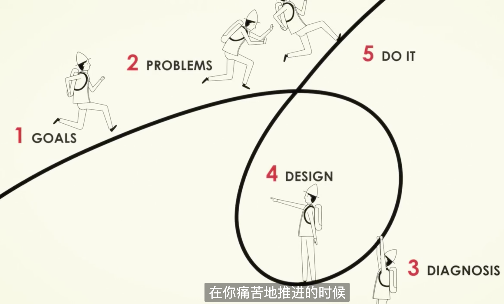

# 原则

## the call to adventure
冒险的召唤，精彩的人生

## embrace reality and deal with it
接受事实、认真对待；接受事实很会痛苦

pain + reflection = progress
痛苦 + 反思(冥想)，就会进步一点点；痛苦是一个学习的信号

成功的定义：dream + reality + determination = success life

伟大的梦想 + 拥抱现实 +决心 = 成功的生活

## The five step process 
成功就是重复这五步
1. goals： 目标、明白想在生活中达成什么（健康，富有车房钱，成就感有企业，有钱想做啥做啥）
2. problems：直面挡在你目标上的问题
3. diagnosis：诊断问题、找出根本原因
4. design：设计消灭问题的计划
5. DO IT：鞭策自己完成这些目标

## The abyss（深渊）
作者陷入绝境：公司解散

反思：风险与回报

如何找到现实的运行原理，并且找到最好的处理方式

## everything is a machine
所有事物都是一个机器，大机器里面的小机器

人：消化系统、免疫系统（食物成了我们的一部分）

万事万物皆有规律、每件事都有其周期，找到并加以利用

风险回报总是相伴、安稳还是冒险靠你的选择

## your two biggest barrieds
你的两大障碍
- 自负自我：大脑的某部分，阻止你客观的承认自己的弱点，让你无法想出解决方案
- 思维盲点：没有人可以凭一己之力就看清事实全局

## be radically open-minded
彻底的开放思想
以习得正确事物的乐趣，取代被认可的满足感

找到最有想法并且反对我的人：
通过他们的眼睛看事物、
也让他们通过我的眼睛看事物
这样才能一起将事物剖析，发现什么是正确的

穿越人生丛林的最佳方法：
与那些富有洞察力且与我世界观不同的人相伴

## struggle well
达到成功之后，很快就不满足了；成功不过就是钓饵；
与他人协作的个人进化，才是拼搏的回报；
让其他人也取得成功；与他人一同进化的旅程才是快乐；

一个机器崩解之后，其成分就会回到系统中，重新组成新机器，继续不断进化
有时这让我们悲伤，因为我们对自己的机器已经产生深厚的感情；
但从更高的层面看，更大机器的进化是一个更美妙的景象；

## 视频
https://www.bilibili.com/video/av24371491
