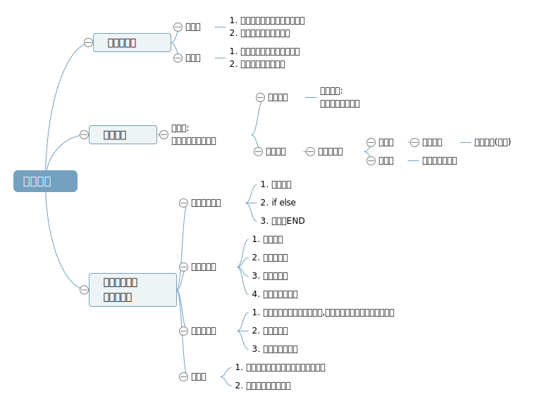

# 编译原理

编译原理是计算机专业的一门重要专业课，旨在介绍编译程序构造的一般原理和基本方法。内容包括语言和文法、词法分析、语法分析、语法制导翻译、中间代码生成、存储管理、代码优化和目标代码生成。 编译原理是计算机专业设置的一门重要的专业课程。编译原理课程是计算机相关专业学生的必修课程和高等学校培养计算机专业人才的基础及核心课程，同时也是计算机专业课程中最难及最挑战学习能力的课程之一。编译原理课程内容主要是原理性质，高度抽象。

## 整体结构
https://naotu.baidu.com/file/9efc6fb0d49c8ddf3054ee9a62bde859

