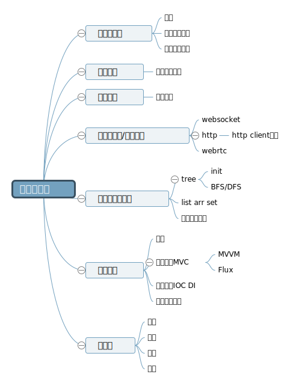

# 计算机知识体系

## 说点什么
工程师是一个使用技术、研发产品的职业，技术是工程师的利器；但世界是复杂的，有时会蹦出些匪夷所思的问题，此时“术”会显得十分笨拙，工程师便需要对“术”进行优化、改造从而解决问题；

这种改造“技术”的能力便是“道”，计算机理论基础就是工程师的内功、即是“道”；

## 计科导图
https://naotu.baidu.com/file/173123df8fa7ab4758423ef78e237bc6

