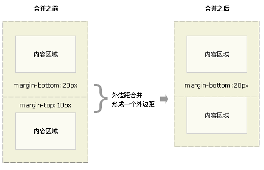

# CSS

## 盒子模型

### 正常盒模型

- #### BLOCK:块级元素

1. block 元素会独占一行，默认宽度自动填满其父元素宽度
1. 包括：内容(content)、填充(padding)、边框(border)、边界(margin)。
1. 总宽度/高度 = width/height + padding + border + margin

- #### INLINE:行内元素

1. 行内元素：一行排满才会换行，宽度随元素内容多少变化
1. inline 元素属性：line-height 设置高度，width、height 无效，只有**水平方向的 margin、padding**边距有效果,垂直方向的 margin padding 无效。

### 怪异模式盒模型

- #### BLOCK:块级元素

1. 盒子的总宽度和高度是包含内边距 padding 和边框 border 宽度在内的
1. 总宽度/高度= width/height + margin = 内容区宽度/高度 + padding + border + margin;
1. 注意：怪异模式下，width = 内容宽度 + padding + border ,width 和内容宽度不是一个概念

### BFC 外边距合并（叠加）

普通文档流中块框的垂直外边距才会发生外边距合并，合并后的外边距的高度等于两个发生合并的外边距中较高的那个边距值


## 选择器

### CSS 选择器优先级：

important > 内联 > ID > 类 > 标签 | 伪类 | 属性选择 > 伪对象 > 继承 > 通配符 通配符 > 继承

### CSS 伪元素

:after，:before 伪元素用法

:after 选择器向选定的元素之后插入内容。使用 content 属性来指定要插入的内容。

```html
<!DOCTYPE html>
<html>
  <head>
    <style>
      p::after {
        content: "- 注意我";
        display: block;
      }
      p::before {
        content: "test";
        display: block;
        color: red;
        position: relative;
        left: 12px;
      }
    </style>
  </head>

  <body>
    <p>我的名字是 Donald</p>
    <p>我住在 Ducksburg</p>

    <p><b>注意：</b> :after在IE8中运行，必须声明 !DOCTYPE</p>
  </body>
</html>
```

## 定位

如果要掌握、运用好 Position、Float 属性必须要对 HTML 的两个基本点有清晰的了解。

1. 盒子模型（box model）
2. HTML 的普通流（normal flow）

[盒子模型](/2017/03/18/CSS-盒模型/)

> 在 HTML 中元素的盒子模型分为两种：块状元素、行内元素，请注意这里的块状元素（Block）和行内元素（Inline）与 Display 属性中的 inline、block 两个属性值并不等同。盒子模型中的 Inline、Block 类似于是 Display 属性的父类，例如：Display 属性中的 list-item 属性值是属于块状（Block）类型的。

> 我们直观的上看两种盒子模型的**区别**

> 块状（Block）类型的元素可以设置 width、height 属性，而行内（Inline）类型设置无效。
> 块状（Block）类型的元素会独占一行（直观的说就是会换行显示，无法与其他元素在同一行内显示，除非你主动修改元素的样式），而行内（Inline）类型的元素则都会在一行内显示。
> 块状（Block）类型的元素的 width 默认为 100%，而行内（Inline）类型的元素则是根据自身的内容及子元素来决定宽度。
> 列举出一些大家常见的元素的分类

> 块状元素：P、DIV、UL、LI、DD、DT...
> 行内元素：A、IMG、SPAN、STRONG...

### HTML 的普通流

> 浏览器在读取 HTML 源代码的时候是根据元素在代码出现的顺序读取，最终元素的呈现方式是依据元素的盒子模型来决定的。
> 行内元素是从左到右，块状元素是从上到下。（如下图）

> 如果你不改变元素的默认样式前提下，元素在 HTML 的普通流中会“占用”一个位置，而“占用”位置的大小、位置则是由元素的盒子模型来决定。因此，在后续讲的 Position、Float 属性是否会使元素脱离这个普通流是一个关键点。

Position:(static、relative、absolute、fixed)：
我们首先来谈谈 Position 属性，因为 Position 属性能够很好的体现 HTML 普通流这个特征。重点在于应用了不同的 position 值之后是否有脱离普通流和改变 Display 属性这两点。

1. Static
   所有元素在默认的情况下 position 属性均为 static，而我们在布局上经常会用到的相对定位和绝对定位常用的属性 top、bottom、left、right 在 position 为 static 的情况下无效。其用法为：在改变了元素的 position 属性后可以将元素重置为 static 让其回归到页面默认的普通流中。

2. Relative
   俗称的相对定位，重点在于对相对理解。我们此前说过每个元素在页面的普通流中会有“占用”一个位置，这个位置可以理解为默认位置，而相对定位就是将元素偏离元素的默认位置，但普通流中依然保持着原有的默认位置，**并没有脱离普通流**，只是视觉上发生的偏移。
   我们先用块状元素来做个示例：

3. Absolute
   俗称的绝对定位，绝对定位是相对而言的，怎么理解呢？应用了 position: absolute 的元素会循着节点树中的父（祖）元素来确定“根”，然后相对这个“根”元素来偏移。如果在其节点树中所有父（祖）元素都没有设置 position 属性值为 relative 或者 absolute 则该元素最终将对 body 进行位置偏移。应用了 position: absolute 的元素会脱离页面中的普通流并改变 Display 属性（重点）！

4. Fixed
   会改变行内元素的呈现模式，使 display 之变更为 block。
   会让元素脱离普通流，不占据空间。
   默认会覆盖到非定位元素上。

### Float

float：none、left、right

#### 特点:

- 只有横向浮动，并没有纵向浮动。
- 当元素应用了 float 属性后，将会脱离普通流，其容器（父）元素将得不到脱离普通流的子元素高度。
- 会将元素的 display 属性变更为 block。
- 浮动元素的后一个元素会围绕着浮动元素（典型运用是文字围绕图片），与应用了 position 的元素相比浮动元素并不会遮盖后一个元素。
- 浮动元素的前一个元素不会受到任何影响（如果你想让两个块状元素并排显示，必须让两个块状元素都应用 float）。

#### 清除浮动的方法：

1. 通过在容器中添加一个标签，设置该标签的样式为 clear: both
2. 容器设置 overflow: hidden
3. :after 属性，实际还是 clear both

```html
<!DOCTYPE html>
<html>
  <head>
    <meta charset="utf-8" />
    <title></title>
  </head>
  <body>
    <div class="out">
      <div class="in">
        in1in1in1in1in1in1in1in1
      </div>
      <div class="in">
        in2in2in2in2in2in2in2in2
      </div>
      <div class="in">
        in3in3in3in3in3inin3in3
      </div>
      <div class="clear"></div>
    </div>
  </body>
</html>

<style media="screen">
  .out {
    border: 1px solid red;
    /*overflow: auto;*/
  }
  .out::after {
    clear: both;
    content: ".";
    display: block;
    width: 0;
    height: 0;
    visibility: hidden;
  }
  .in {
    float: left;
    height: 100px;
    border: 1px solid gray;
  }

  .clear {
    /*clear: both;*/
  }
</style>
```
