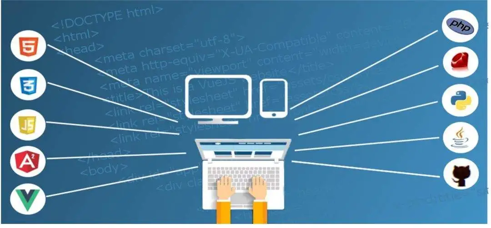

### 大厂前端面试指南

### 互联网涨薪：
互联网是一个日新月异的行业，该行业有些潜规则你可能也听过：
1. “头条入职即巅峰”
2. “阿里P7挤破头”
作为一个技术人员，想在一家公司内部升职加薪实际上是很难的。头条的绝大多数研发连续三年都不涨薪；入职阿里的P6，没有好机会基本不可能升P7。也就导致很多程序员靠不断跳槽来提升薪资。哈~，既然不能改变现状，那就顺应涨薪靠跳槽的潮流，提升应试能力。

### 专业硬实力：
不管是管理岗还是一线开发职位，技术硬实力都是必须的，一般来说大厂对前端专业硬实力有5个考查维度：

- 前端基础：熟练乃至精通 JavaScript、CSS、算法基础；
- 前端框架：熟悉React/VUE、虚拟DOM、状态管理、组件化原理；
- 前端生态：熟悉打包构建、性能优化、网络协议、安全策略；
- 领域话题：一般来说看你从事的具体业务，商业化领域、中后台领域都会有各自独立的话题比如 微前端、权限、日志、告警、脚手架、可视化搭建、性能优化、安全策略；
- 基建相关：了解CI/CD、基础后端技术、基础运维技术

这五个纬度，其中每个点都可以展开非常非常多的内容，在一般工作中不太可能每种问题都遇到，踏实的完成手上的工作，把自己常用的技术框架原理研究通透，甚至产出几个亮点项目，其实问题就不大了。

其他不熟悉的点可以找相关的网络博客去看，后续也会陆续在该公众号更新，欢迎订阅。但近年来随着博客泛滥，不少知识点背一背也能应付过去，导致企业面试过程中更加重视基础算法。大家可以根据不同公司风格进行准备。

### 通用软实力：
软实力很虚，但也有不少小伙伴会被大厂的HR刷掉。其实要把握核心，就是明确你和公司是利益关系，公司雇佣你是为了让你解决问题、创造价值、带来收益，站在公司的角度考虑问题才更有机会：

- 沟通能力：是否能言简意赅的向他人表达自己的想法；是否有足够的理解力，快速get他人想法，并加以反馈。
- 协作能力：是否清楚的知道你的职位在业务中的定位，以及上下游的合作关系；是否能站在其他角色的角度去思考问题、共同协作以推动业务发展。
- 项目管理：能否能对一个具体项目进行价值衡量、目标管理&拆解、进度把控、风险评估。
- 企业认同：是否认同一家企业的文化、价值观、整体决策？如果表现出不认同的态度，HR会认为你可能无法与组织形成合力、甚至拖累组织行动，导致面试被刷。

这些软实力都需要在社会工作中持续打磨，并非一朝一夕，认真踏实的完成手上的工作，多站在他人角度考虑问题，会让你的思维更加严谨、包容。

### 写在最后：

其实关于面试、加薪，主要在于日常工作中的积累

关于硬实力：日常工作中遇到技术问题多思考多研究，把某个技术难点背后的原理弄通透，并加以运用实践，有亮点产出，面试官也就不会为难你。有时候面试官东问西问，其实就是想找找你有没有亮点产出、深度思考、迎难而上的特质、解决棘手问题的能力，平庸而泛泛的人太多了。

关于软实力：多与他人交流沟通，沟通的多了，自然能了解其他角色的问题、难处、思维方式；同时也要多找你的上级聊聊，才能更懂你的公司，而不至于和同级同事一起变成“怨妇”。

祝大家马到成功，找到自己心仪的公司，并往财务自由的道路上再迈进一步！