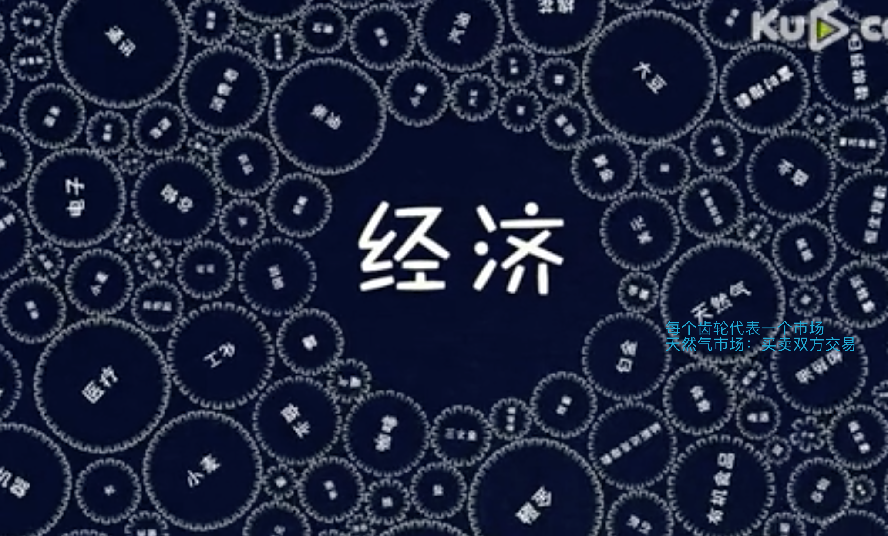
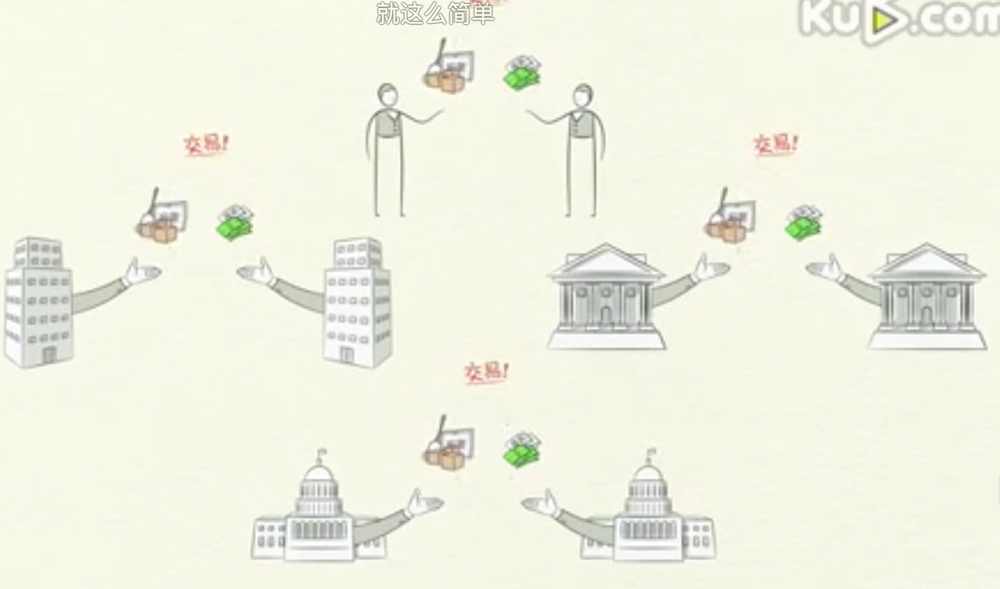
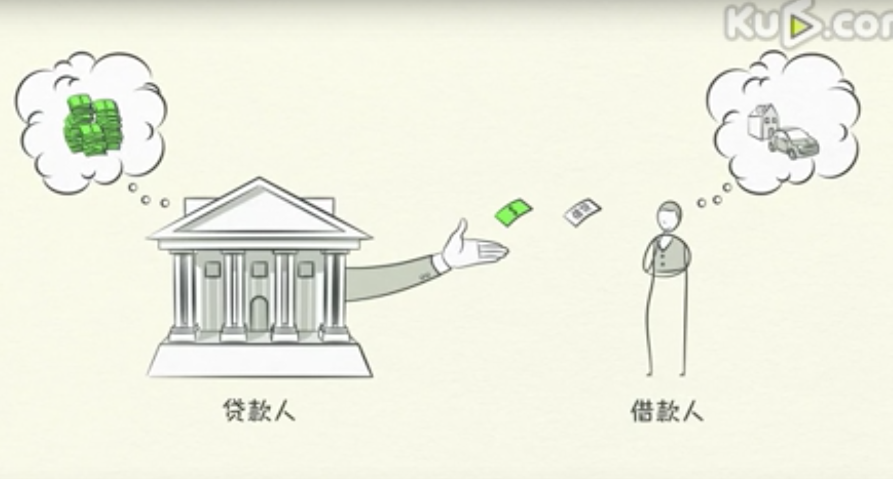
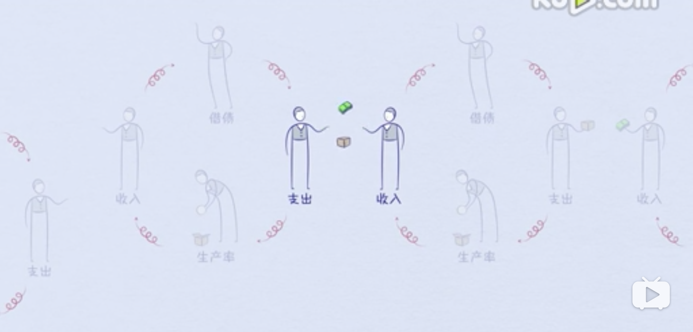
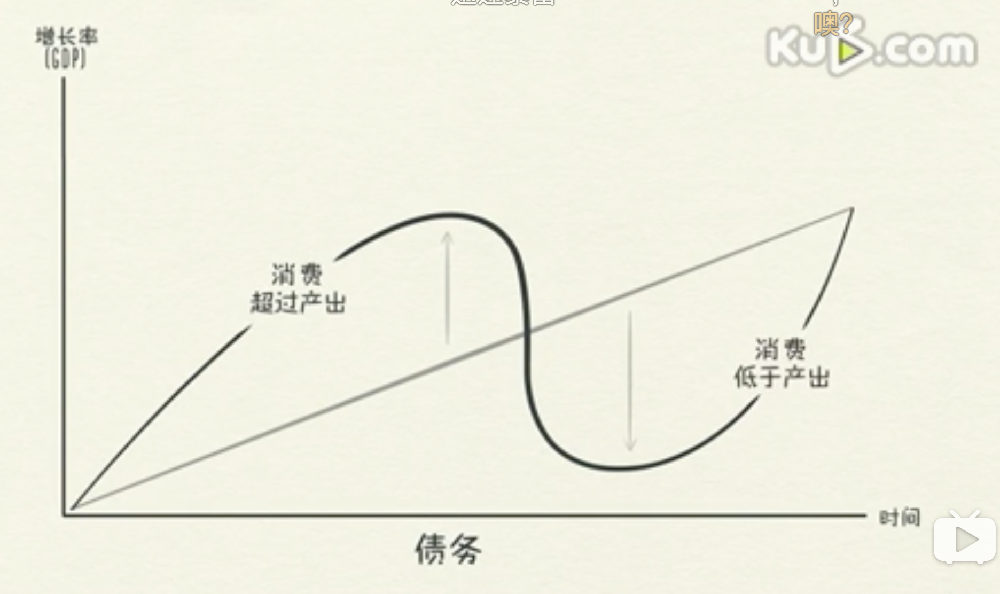
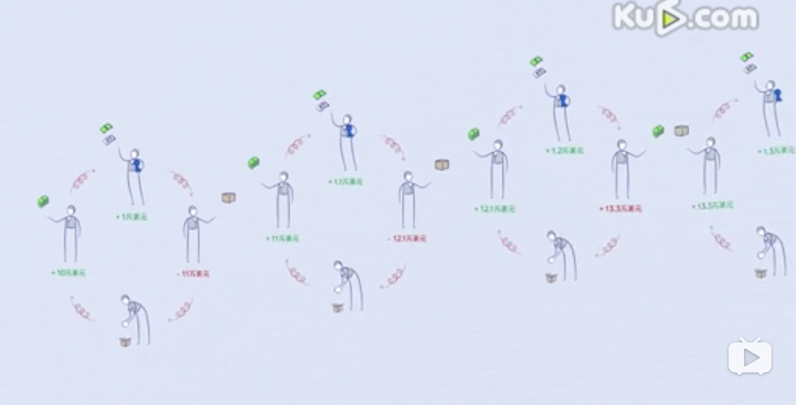
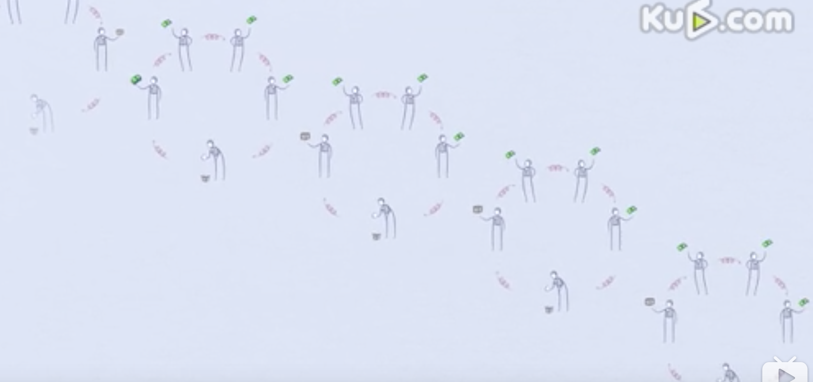
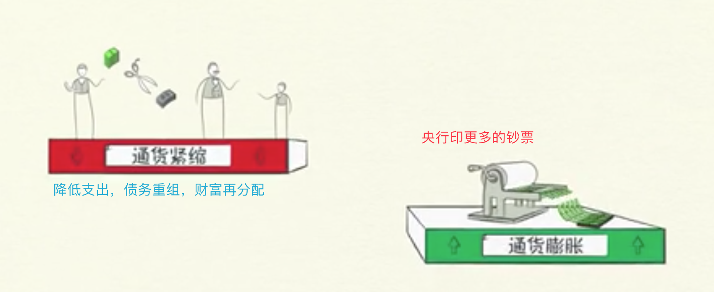
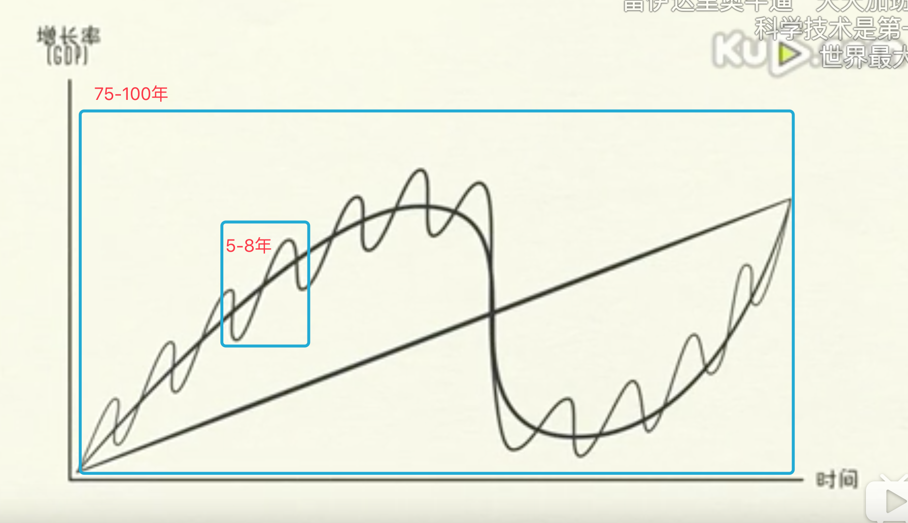

# 经济机器运转

## 经济的三个驱动力：

生产率提高、短期债务周期、长期债务周期

## 经济的组成

1. 交易：由买方和卖方组成：信用+货币 <=> 商品+服务+金融资产
2. 市场：小麦市场、钢铁市场、汽车市场
3. 经济：由所有市场内的全部交易构成，交易是经济的

个人、企业、银行、政府都在从事上述交易

## 政府组成部分

1. 中央政府：收税+花钱
2. 中央银行：
    - 控制经济中的货币+信贷数量
    - 银行通过利率+发行货币实行这种控制

## 信贷：可以同时满足借款人和贷款人的需要

贷款人：把钱存在银行、期望生出更多的利息

借款人：想要买当前无力购买的东西 房-车-企业、因此需要借钱，并保证未来偿还本金+利息

任何两个人都可以通过协定、凭空创造信贷
信贷一旦产生：就是借款人的资产、借贷人的债务

## 经济周期

一个人的支出是另一个人的收入，你每花多一块钱别人就会多赚一块钱，
如果某人的收入增加，其信用度就会提高，贷款人就更愿意把钱借给他。

所以一个人的收入增加，借贷也会增加，支出增加，别人的收入也增加。
因此，经济周期就产生了

## 生产率

知识的积累会提高我们的生活水平，我们将此称为生产率的提高。

生产率在长期内最关键、信贷在短期内最重要。

借贷会在短期内让消费高于产出，还债债务会让消费低于产出。

短期债务周期：持续 5-8 年

长期债务周期：持续 75-100 年

## 小周期：通货膨胀+通货紧缩
   人的天性，导致不停的消费、不停的借贷会导致通货膨胀的升高
   央行在看到物价过高时、就会提高利率

央行看到物价下跌，通货膨胀问题不存在，就会降低利率

因此人们会减少借贷+还款成本增长+支出减少+收入减少 => 价格下跌 => 通货紧缩 => 经济下行

## 去杠杆化
- 小周期：经济衰退，可以通过降低利率来挽回；
- 大周期：去杠杆化，由于利率已经降低到 0，无法通过降低利率挽回；

- 去杠杆化方式：
    1. 降低支出：降低支出，从循环上来说，但是也会降低每个人的收入，通货紧缩，无法解决问题 
    2. 减少债务：债务重组、利率下降，但是会导致每个人的资产贬值，通货紧缩，无法解决问题 
    3. 财富再分配 ：增加富人税收、穷人富人互相怨恨，社会动荡、国家政治变革、战争 
    4. 发行更多货币：发行货币，引起通货膨胀，购买政府债券、金融资产

## 三条简单的经验法则
1. 不要让债务的增长速度超过收入：债务负担会把你压垮
2. 不要让收入的增长速度超过生产率：会让你失去竞争力
3. 尽一切努力提高生产率：长期最关键

## 视频
https://www.bilibili.com/video/av8482665?p=1
