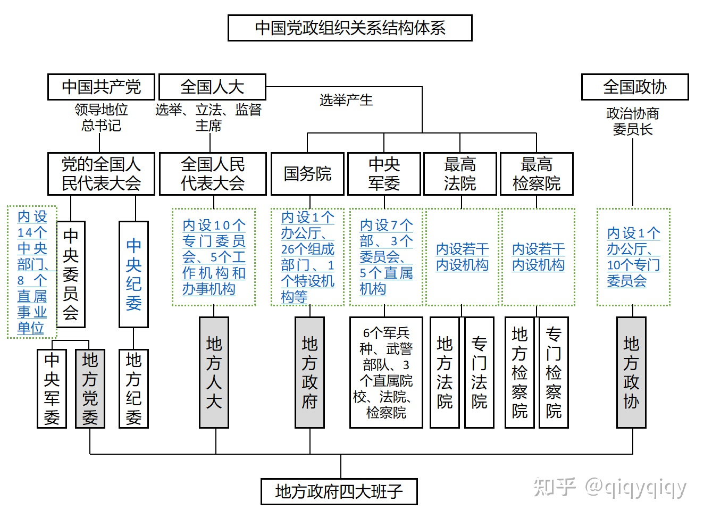

# 国家机构

## 全球划分
- 第一世界：国家指美国、欧洲等发达国家

- 第二世界：国家指新兴工业化国家，主要包括日本、欧洲、澳大利亚、加拿大

- 第三世界：包括亚洲、非洲、拉丁美洲、大洋洲及其他地区的130多个发展中国家，占世界陆地面积和总人口的70%以上。此名词最先由Alfred Sauvy于1952年8月14日提出

- 第四世界：包括撒哈拉沙漠以南的非洲各国，已被视为第四世界

## 中国政治体系

### 四套班子

### 概览
- 国家级、（中国：14亿）
- 省部级、（安徽省：7000万）
- 厅局级、（淮南市：250万）
- 县处级、（凤台县：63万、田家庵区：52万）
- 乡科级、（舜耕镇：2.5万、三和乡：2.8万、泉山街道：2.3万）

### 结构
- 国家级正职
中共中央总书记、中共中央政治局常委、国家主席、全国人大常委会委员长、国务院总理、全国政协主席、中国共产党中央军事委员会主席、国家军委主席。[1] 

- 国家级副职
中央政治局委员、中央书记处书记、中央纪委书记、国家副主席、全国人大常委会副委员长、国务院副总理、国务委员、全国政协副主席、中共中央军委副主席、中共中央军委委员、国家中央军委副主席、国家军委委员，最高人民法院院长、最高人民检察院检察长。
中共中央直属各机构正职及部分副职一般为政治局常委、委员、书记处书记及其他副国级干部兼任。

- 省部级正职
 省级行政区（省、自治区、直辖市和特别行政区）的省（党、市）委书记、省长（政府主席、市长）、政协主席、人大常委会主任、特别行政区行政长官
新疆生产建设兵团的政委和司令员（明确为正部长级）
全国人大、国务院、全国政协各部委正职干部（如教育部部长、国家发改委主任）
中央纪委正部级副书记、中共中央直属各机构正职、特殊副职及办公室主任（中联部部长、中宣部副部长、中组部副部长、中央统战部副部长、中央党校副校长，中共中央办公厅副主任）
国家正部级企业正职领导（如铁路总公司总经理、中投公司总经理、董事长[2]  ）
中央委员一般由省部级正职担任

- 省部级副职
国务院各部委副职干部（如公安部副部长、国家体育总局副局长）
国务院部委管理的国家局正职干部（如国家文物局局长）
各省、自治区、直辖市、新疆生产建设兵团政府副职干部（如吉林省副省长、重庆市副市长、新疆建设兵团副司令员）、政协副主席、人大常委会副主任、直辖市市委副书记等
各副省级市政府正职干部（如南京市市长）
各直辖市下属副省级新区正职干部（如浦东新区区委书记、区长）

- 厅局级正职
以前叫地厅级，主要是地级市（各自治州及新疆生产建设兵团各师）市委书记、市长、市人大主任、市政协主席、省级下属单位，（如省公安厅厅长、国家各部下属单位，如外交部新闻司司长 ）
国务院部委各司正职干部，部分副职（如教育部社会科学研究与思想政治工作司司长，国家安监总局国际合作司副司长）
各省、自治区、直辖市、新疆生产建设兵团厅局正职干部（如河北省交通厅厅长，北京市财政局局长、新疆兵团林业局局长）
各副省级市政府副职干部（如宁波市副市长）
各地级市政府及新疆生产建设兵团各师正职干部（如宁夏固原市市长、新疆兵团农八师师长）
注：以上为高级干部

- 厅局级副职
 地级市（新疆生产建设兵团各师）市委副书记、市委常委、副市长、市人大副主任、市政协副主席，省级下属单位，如省委宣传部副部长、国家各部下属单位，如外交部新闻司副司长等
国务院部委各司副职干部（如人事部人才流动开发司副司长）
各省、自治区、直辖市、新疆生产建设兵团厅局副职干部（如黑龙江省建设厅副厅长、上海市文化局副局长、新疆兵团农二师副师长）
副省级市所属各局及各区县政府正职干部（如长春市朝阳区区长）
各省市区直管县县长，县委书记（如河南省长垣县县长）

- 县处级正职
 包括县（县级市、区、旗及新疆生产建设兵团团级等）委书记、（区）县长、（区）县人大、（区）县政协主席、市各单位局长，如市公安局、司法局等
国务院部委各司所属处室正职干部（如农业部种植业管理司经济作物处处长）
各省、自治区、直辖市、新疆生产建设兵团厅局所属处室正职干部（如江苏省科技厅农村科技处处长）
副省级市所属各局及各区县政府副职干部（如西安市卫生局副局长、蓝田县副县长）
副省级市所属各局处室及区县各局正职干部（如南京市科技局科技成果处处长、玄武区卫生局局长、XX区XX街道办事处书记、主任）
地级市（新疆兵团各师）所属各局及各区县政府正职干部（如绵阳市劳动局局长、三台县县长）
新疆生产建设兵团各团正职干部（如新疆兵团农八师142团团长、政委）

- 县处级副职
包括县（县级市、区、旗、新疆生产建设兵团团级等）委副书记、县（区）委常委、副县（区）长、副（区）县人大、副（区）县政协主席、市各单位副局长，如市公安局、司法局等
国务院部委各司所属处室副职干部（如农业部兽医局防疫处副处长）
各省、自治区、直辖市厅局所属处室副职干部（如江苏省教育厅人事处副处长）
副省级市所属各局处室及区县各局副职干部（如南京市科技局科技成果处副处长、玄武区卫生局副局长、XX区XX街道办事处副书记、副主任）
地级市所属各局及各区县政府副职干部（如德阳市民政局副局长、佛山市顺德区副区长）
新疆生产建设兵团各团副职干部（如新疆兵团农八师150团副团长、副政委、武装部长、工会主席、总农艺师、总会计师）

- 乡科级正职
包括各乡、镇、办事处、新疆生产建设兵团团场各营党委书记、乡长、镇长、办事处主任、以及镇级人大等。
县、县级市下属各局，如县公安局长、县建设局长等。
地级市局下属各处，如市建设局法制处长等。

- 乡科级副职
包括各乡、镇、办事处党委副书记、党委委员、副乡长、副镇长、办事处副主任、以及镇级人大副主任等， 新疆生产建设兵团团场机关科室科长各营（分场）党委书记、营长（分场场长）等，如（新疆生产建设兵团农六师芳草湖农场工交建商科科长、芳草湖农场工会副主席、芳草湖六场书记、六场场长）。
县、县级市下属，如县公安副局长、县建设副局长等。 地级市局下属，如市建设局法制副处长等。

- 乡科级以下
就是所谓的股级（股所级），是中国行政当中最小的，一般是乡里边财政所、派出所之类的以及新疆生产建设兵团连级等。新疆生产建设兵团连级及副连级，（如新疆生产建设兵团农一师1团1连连长、指导员、副连长）

## 特别说明
1. 各高等院校、科研院所、医院等事业单位，其各级干部参照政府各级干部待遇，具有行政级别，但不属于公务员编制；

2. 新疆生产建设兵团的行政级别是正省（部）级，故兵团司令员、政委的行政级别均为正省（部）级，下属各个师的师长、政委的行政级别均为正厅（局）级，下辖的农牧团场的团长、政委为正处级;

3. 政府各级干部如为上一级党委常委，则其行政级别升一级。如张家港市市长为正处级干部，若为苏州市市委常委，则为副厅级干部。按例，高级干部在60或65岁以后往往调往相应级别的人大、政协担任领导职务，俗称“退居二线” ;

4. 有一些行政级别是正厅但是必须要副部来兼任的，一般认为那个单位是副部单位，如省宣传部、组织部、纪委等必须由省委常委或者省委副书记兼任；有一些行政级别是正处但是必须要副厅来兼任的，一般认为那个单位是副厅单位，如市宣传部、组织部、纪委、政法委等必须由市委常委或者市委副书记兼任。

5. 依据十五届四中全会《决定》，企业已经逐步取消了行政职务划分，不再与地方政府对应职务。在过去，跟据所属单位的大小，国企的级别一般不超过主管单位，基本上是降半级或一级。从这几年一些中央国企的领导干部与中央或地方国家机关领导干部调任情况来看，事实上还是保留级别的，比如一些央企的董事长、总经理去担任省长、副省长或者副部长等。

6. 备注：
副省级市有哈尔滨，长春，沈阳，大连，济南，青岛，南京，杭州，宁波，厦门，广州，深圳，武汉，成都，西安共15个。
直辖市下属副省级新区有上海浦东新区、天津滨海新区、重庆两江新区

7. 准副省级：包括除上述城市以外的所有省会城市和国务院批准的唐山市、大同市、包头市、鞍山市、抚顺市、吉林市、齐齐哈尔市、无锡市、淮南市、洛阳市十个市为“较大的市”。
“较大的市”是一个法律概念，是为了解决地级市立法权而于1982年创设。非省会地级市一旦获得“较大的市”地位，就拥有了地方立法权。

8. 重庆市曾经一直是副省级城市，1997年2月成为省级的直辖市。
副省级城市、副省级新区为中华人民共和国行政区名，受省（直辖市）级行政区管辖，副省级市的市长、副省级新区的区长与副省长行政级别相同。最初的十六个副省级城市是根据1994年2月25日，中央机构编制委员会的发文（中编[1994]1号）经中共中央、国务院同意成为副省级城市的。副省级城市与地级市或地级行政区一起纳入各省的直接管辖之下，没有被单列。

