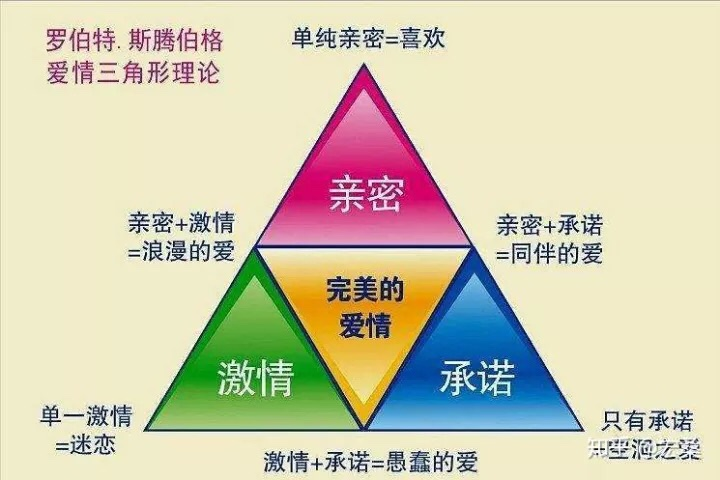

# 情感

## 亲密关系
1. 外表：性价值（你的颜值，身材，打扮，以及sex和谐度等）
2. 资源：经济价值（你的学历，工作，收入，发展空间，房车，家境等）
3. 性格：情绪价值（你的脾气，温柔体贴，善良懂事，愿意为对方付出，为对方着想，遇事不作，俩人能良好的沟通。具备精神层面的交流，兴趣爱好，三观一致等）

## 追求异性
### 获取好感
1. 身材匀称，外表干净。（不要太多肌肉、不要死肥宅）
2. 感性的聊天方式
3. 给女生带来安全感，永远不要让她焦虑
4. 夸她（不要对女生的外表品头论足）
5. 送小礼物，吃的，玩的
### 确认好感：
1. 走路靠近她
2. 说小秘密，看她反应，会不会把耳朵贴过来
3. 会不会油头来见你 
### 建立亲密关系：
1. 尝试牵手，不要表白
2. 在没有表达对你的好感之前，不要公开送礼物，但可以送小礼物（零食什么的）

https://www.zhihu.com/question/24399457/answer/407219299