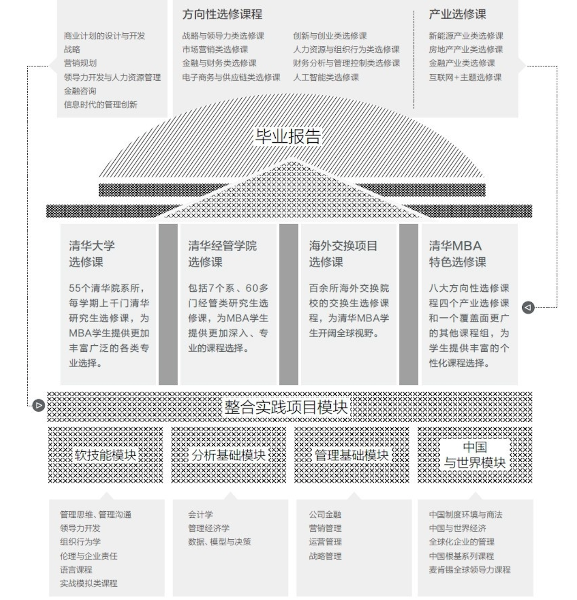

# MBA 课程体系

## 体系结构

## 必修课

1. 软技能
- 体验领导力项目：通过领导力评测，使学生了解自己领导能力的长短板，了解提升自己领导力的具体方法，认清未来努力的方向。
- 管理思维与沟通：培养学生管理沟通意识，了解沟通策略并提高个人的沟通技能，改进和提高学生演讲、倾听等沟通能力。
- 领导力开发与组织行为：通过理论学习、应用分析和技能培养三个步骤，来提升学生的领导力技能。
- 伦理与企业责任：启发学生的伦理意识，让学生们能够自我反省那种简单的"好/坏"判断式的思维（批判性思维），并充分体会每一决策情景的复杂性。
- 语言课程：使学生学习掌握有关商务、管理方面的词汇，快速提高学生的英语水平，特别是商务情景下的口头交际能力。

2. 分析基础
- 会计学：通过讲解盈利组织（即企业）会计的基本概念、基本原则和基本方法，使 MBA 学生能够理解和初步分析应用企业财务报表。
- 管理经济学：该课程介绍微观经济学的基本原理及其在企业管理中的应用，包含市场需求与弹性分析；生产与成本分析；不同市场结构下的企业经营决策分析等有关的经济学基本内容。
- 数据、模型与决策：本课程介绍管理决策问题的基本概念和建模方法，包括应用数理统计和运筹学两部分。

3. 管理基础
   书籍：
- 公司金融：MBA 主干课程之一，涵盖了现代财务管理的基础知识，并会对企业一些基本财务政策的影响进行分 析。
- 营销管理：营销是创造价值、与顾客沟通和向顾客传递价值的过程。课程所讲授的概念、所提供的案例和讨论将会帮助你将这些营销思想内化到自己的营销实践中。
- 运营管理：运营活动是将人力、物料、设备、资金、信息、技术等生产要素(投入)变换为有形产品和无形服务(产出)的过程，目的是要通过有效运用有限资源实现收益最大化。
- 战略管理：深入分析企业的基本竞争战略及其适用条件

4. 中国与世界
- 中国制度环境与商法
- 中国与世界经济
- 全球化企业的管理

5. 整合实践
   整合实践项目是清华 MBA 师生为企业管理问题提供诊断与咨询的学生实践项目。

清华 MBA 选修课程包括七大方向性选修课组、四个产业选修课组和一个覆盖面更广的其他课程组。既照顾到满足自身兴趣特点、职业倾向性需求偏好，又能够具备日后职业发展所需要的广博工商业管理知识储备，实现二者的互动和统一。

## 选修课

- 市场营销方向
- 创新与创业方向
- 金融与财务方向
- 财务分析与管理控制方向
- 电子商务与供应链管理方向
- 企业战略与领导力方向
- 人力资源与组织行为方向
- 房地产行业类
- 新能源行业类
- 汽车产业类
- 其它任选课程
