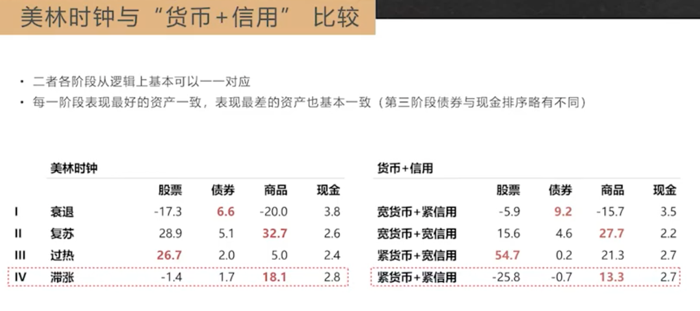
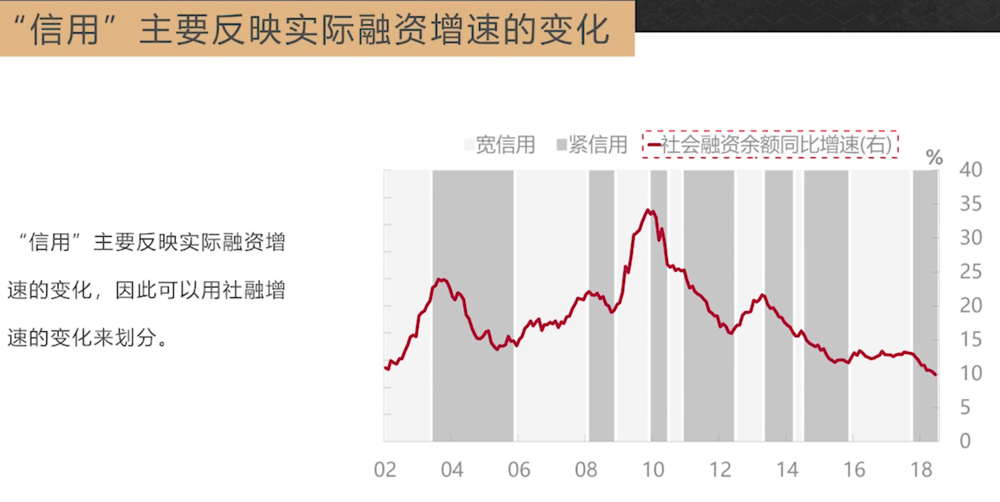
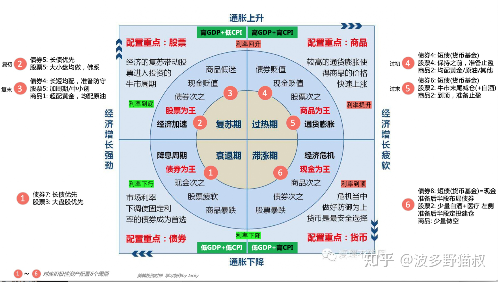
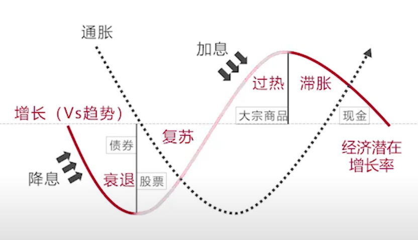

# 资产配置

## 资产配置后的价值观
- 大量比特币：认为未来是数字世界，现有的货币/信用体系将崩塌
- 大量公司股票：上市企业是创造创造财富的源泉
- 大量现金：货币信用体系不会坍塌，但是未来大通缩，债务得不到偿还
- 大量黄金：乱世要来了，可能有恶性通货膨胀出现

## 信用货币体系（中国）
宽信用、紧信用，宽货币、紧货币；
- 宽信用阶段：股票都是涨的，不用管货币利率怎么走
- 紧信用阶段：股票都是阶段

## 美林时钟体系（美国）
好看但不实用

美林时钟曲线

