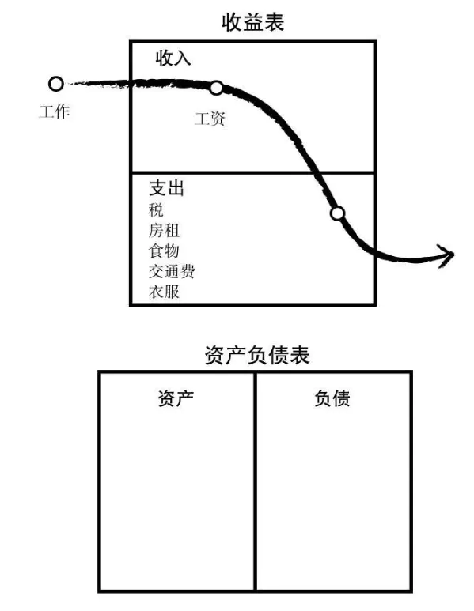
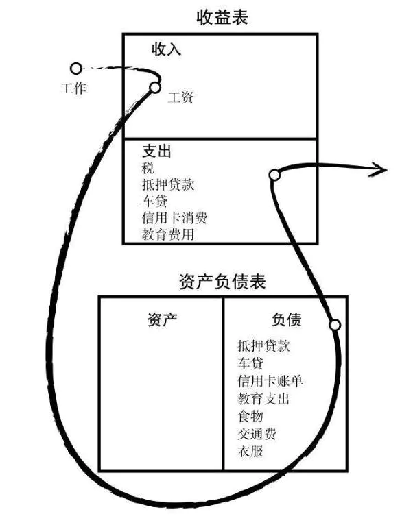
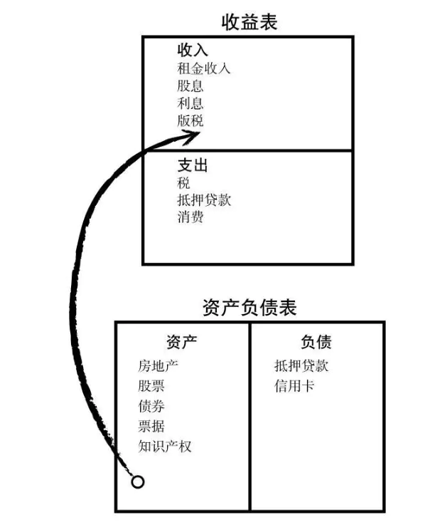
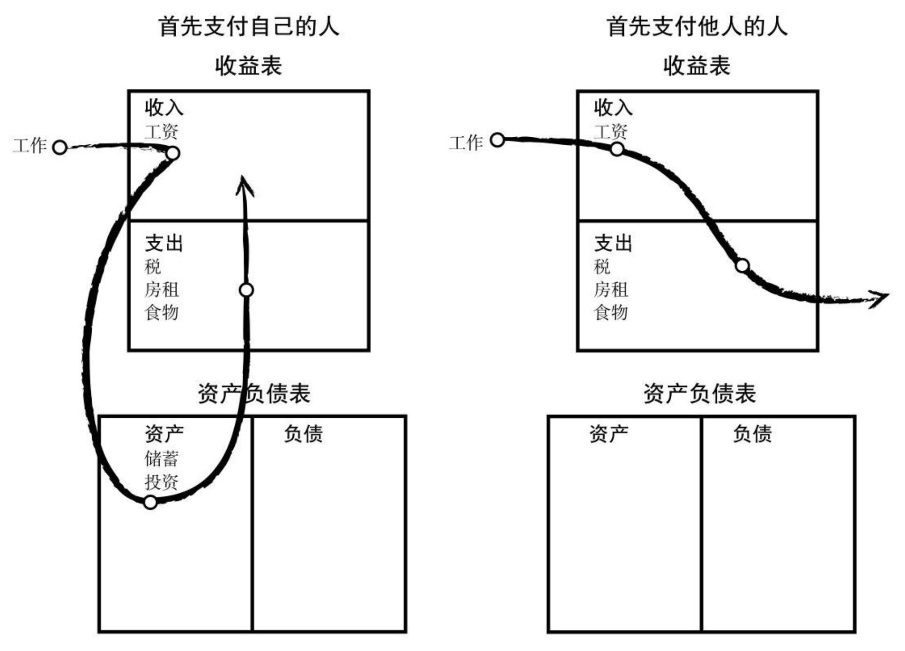
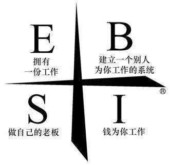
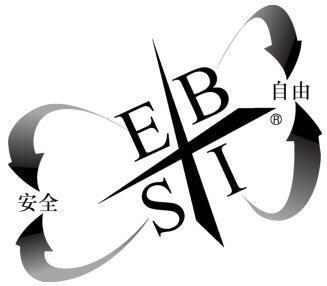
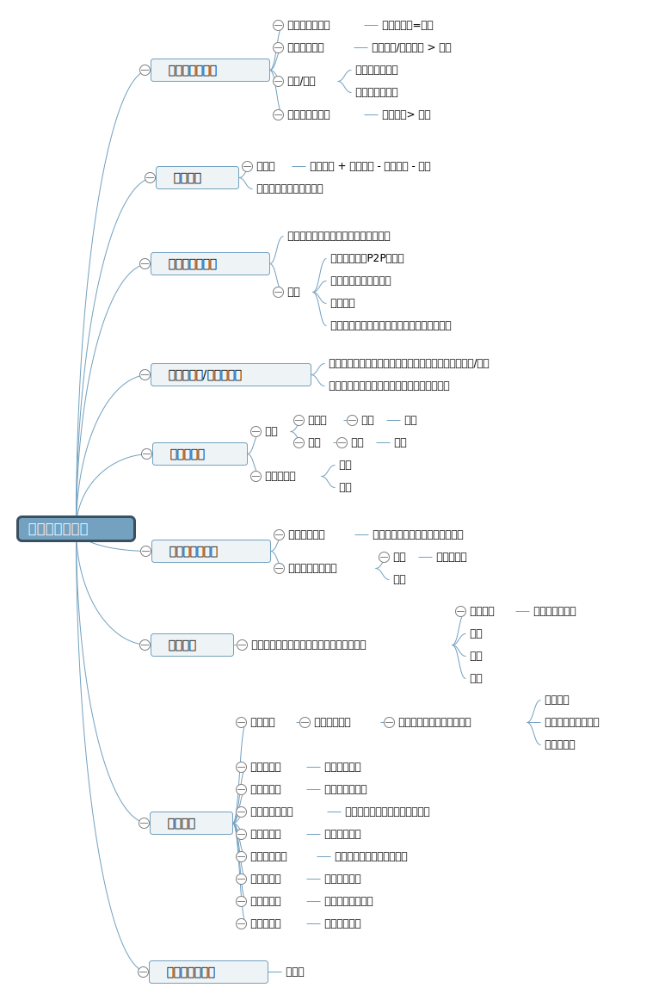

# 穷爸爸富爸爸

## 第一课:富人不为钱工作

作者有“两个爸爸”，穷爸爸是典型的工薪阶层，会为自己的劳动权益去学习、去斗争，关注职位、工资、待遇福利；富爸爸是一个老板，具有富人思维，说的少做得多，喜欢用行动来证明一件事，并且知道如何让钱为自己工作。

作者 9 岁时想学习如何赚钱；于是富爸爸给了作者一份低薪工作，并用真实生活教会了作者一些道理：

- 不要为钱工作，要学习支配金钱、学习如何让钱为你工作 --- 自由
- 生活是一门课程，他不会用语言来教你，他只会推着你转；你要从生活中进行学习
- 要正确对待 理智&感情，感情是我们行动的动力、理智能换来好的结果
- 要直面自己的感情，学会控制恐惧与欲望，不然即使发了财，也会因为欲望而成为金钱的奴隶
- 老鼠赛跑：恐惧让人去工作、贪婪让人过度消费，于是形成了 起床、上班、付账、再起床、再上班、再付账的循环；这些人完全成了感情的努力，感情替代了他们的思想

经过富爸爸教导，虽然做着免费工作，但作者发现一个机会：可以书商回回收废旧的连环画，于是开起了“连环画阅览室”租阅给其他孩子，并用这种手段赚到了钱一笔钱

## 第二课: 分清资产与负债

**必须明白资产和负债的区别，并购买资产**

- 资产：能把钱放进我口袋的东西，不管我工作与否
- 负债：把钱从我口袋里取走的东西

**穷人、中产、富人现金流图：**

1. 穷人只有支出

2. 中产阶级获购买自以为是资产的负债（要为老板、银行、政府工作）

3. 富人关注资产

## 第三课：关注自己的事业

**什么是事业？**

- 职业和事业有很大的区别，你到底拥不拥有它；“你可以在 xxx 工作，但同时也要有自己的事业“
- 事业的**重心**是你的资产项，而不是收入项
- 有趣的事：银行会把你的房车算作资产，但如果房车不能给你带来现金流而是在吃掉你的现金流，那么它们其实是负债而非资产

**真正的资产有哪些？**

1. 不需要我到场就可以正常运转的业务，我拥有它们而别人在经营和管理；如果我必须在那里工作，那他就是我的工作而非资产
2. 票据、股票、债券
3. 能够产生收入的房地产
4. 版税：音乐、手稿、专利
5. 其他任何有价值，可以产生收入的或有增值潜力并且有很好销路的东西

**自我奖励**
当你的现金流增加的时候，可以购买点奢侈品作为奖励

## 第四课：税收的历史和公司的力量

**富人利用公司来进行合法避税**

1. 拥有公司的富人：挣钱 => 支出 => 缴税
2. 为公司工作的穷人：挣钱 => 缴税 => 支出

**财商：**

1. 会计：财务知识、解读数字的能力、评估一项生意的优势劣势
2. 投资：钱生钱的科学和策略
3. 市场：供给与需求的科学以及市场条件
4. 法律：减税优惠和在诉讼中获得保护

## 第五课：富人的投资

- 资产已经从过去的“土地”，现在逐渐转变为“信息”
- 金钱不是真正的资产，穷人和中产为了钱工作、富人去造钱，最重要的资产是我们的头脑

**投资者分类**

1. 一揽子投资的人（格雷厄姆--防御型投资者）

   - 找到经纪人、规划师;
   - 去购买共同基金、房地产投资信托、股票、债券;
   - 就像是去买一台组装好的电脑;

2. 创造机会的投资者（格雷厄姆--进攻型投资者）
   - 寻找其他人都忽视的机会
   - 增加资金
   - 把精明的人组织起来：聪明的人往往会雇佣比自己跟聪明的人和他们一起工作

## 第六课：学会不为钱工作

> 一个来向我请教的优秀女作家“为什么我的书不畅销？”，我建议她去学习销售技能，而她却不屑于学习销售技能，因为她认为这是一项卑贱的技能

一个事实，我们绝大多数从学校里出来的人都只掌握一门专业技能，而这样导致我们很难挣到钱；
大部分人需要学习掌握不止一项技能，只有这样她们的收入才能显著增长；
许多才华横溢的人之所以穷，是因为他们只专注于做好产品，而对商业体系却知之甚少；

不要单纯为了赚钱和安稳而工作，应当再找一份工作，并从中学习另一种技能

成功需要：专业技能、销售能力、管理技能

- 最重要的专业技能是销售和对市场营销的理解；
- 管理技能包括：对现金流的管理、对系统的管理、对人员的管理

## 克服困难

有时掌握财务知识的人还不能积累丰厚的而且能产生大量现金流的资产项，主要原因有 5 个：

1. 恐惧：
   - 人们对金钱有恐惧，害怕亏损；我从未遇见过没亏过钱的富人，却见过许多从未亏钱的穷人
   - 一个安全的投资组合对于注重安全的人来说是很合适的，但不是一个成功的投资者应该有的投资方式；如果你的资金很少而又想致富，你必须首先集中于一点，而不是追求平衡；那些成功的投资者最初肯定不是追求平衡的，把你大部分鸡蛋放在较少的篮子里，并集中经历，坚持一种投资战略直到成功
2. 愤世嫉俗的小鸡：

   - 很多人害怕失败，像个小鸡一样嚷嚷着“天要塌下来了”，“因为疫情就害怕的不敢出门”，“因为生牛肉吃死人就不允许生牛肉出现”，要学会过滤掉这种噪音

3. 懒惰：
   - 想要克服懒惰，需要变得稍微贪婪一点，上一辈常教导我们“贪婪的是坏人”，但这会让我们因为一些“美好的愿望”而变得有负罪感；
   - 负罪感比欲望更糟，因为负罪感它会夺走我们的灵魂
   - 适度的“欲望”，是人类进步的动力，想要更好的生活、物质条件是社会进步的源泉
4. 不良习惯：要学会先支付自己
5. 自负：“我知道的东西会给我带来金钱，我不知道的东西使我失去金钱”

## 开始行动

建议采取 10 个步骤来唤醒你的理财天赋

1. 找个超现实的理由--精神的力量
   - 想要什么？为了自由，自己喜欢的人
   - 不想要什么？不想做一个打工仔
2. 每天做出选择--选择的力量
3. 慎重的选择朋友--关系的力量
4. 掌握一种模式，然后学习一种新的模式--快速学习的力量
   - 如果对你挣钱的方式感到厌倦或者觉得不够多，那么改变你的挣钱模式
   - 不断学习新的挣钱模式：打工、产品付费、技能咨询、售卖代码产品
5. 首先支付自己--自律的力量【最难的】
   - 
   - 自律是十个步骤中最难掌握的
   - 能否自律是将富人、穷人、中产区分开来的首要因素
   - 不要仅将注意力放在产品/服务或生产设备上，而要集中精力开发管理才能:现金流管理，人事管理，个人时间管理

6. 给你的经纪人以优厚的报酬--好建议的力量
7. 做一个“印第安给予者”--无私的力量
8. 用资产购买奢侈品--专注的力量
9. 对英雄的崇拜--神话的力量
10. 先予后取--给予的力量

## 财富四个象限

1. 【E】employee: 雇员—保障比金钱重要。 特点：求稳定求保障，依赖福利。
2. 【S】self-employed: 自由职业者—他们的独立性、按照自己的方式做事的自由，以及在自己的领域里被尊为专家，都要比单纯的金钱重要得多。
   特点：亲力亲为，完美主义，独立性。
3. 【B】business-man: 企业家—雇佣牛人为自己工作 如果你有能力雇用别人为你做事，而且他们能比你做得更好时，为什么还要自己做呢？
   特点：领导大家为自己赚钱，分配工作委托工作。
4. 【I】investor: 投资者---睡后收入，钱生钱，财富自由的最高境界。

**四个象限的区别**

1. 【E】和【S】是用自己的勤奋和技能赚钱，是一种不努力就没有的收入，在长期的工作中我们也会发现工作越出色越导致你更辛苦的工作，而右侧象限【B】和【I】则是利用他人的时间和金钱赚钱的手段，是一种自动运营的收入，当系统成熟时你不需要花费时间和精力去管理，而是真正的时间自由、财务自由。
   左侧象限为了安全而逃避风险结果很可能一生都在为工作奔波，而右侧象限因追求自由而面对风险从而经过练习能驾驭风险实现真正的自由。

2. 【B】企业家靠的是一个人的领导力和经商的技能。
   领导力就是激发人们做出最好表现的能力，也就是与人相处的能力。关于如何提升领导力可以多看看相关的书籍。
   经商的技能包括阅读财务报表、市场营销、推销、会计、管理、生产和谈判等等。

3. 【I】象限的真正的投资者考虑的是风险性而不是安全性，他们明白波动意味着机遇，意味着更大的收益，他们积极学习理财知识，从而在投钱的那一刻就已经知道了会有多少收益，对【I】象限的人来说，这不是赌博而是一场技能游戏，他们考虑的是怎样以最快的速度收回本金。

**是否陷入误区**

1. 你是否换了一份又一份的工作，却没想到自己一直在【E】象限不停打转？
2. 你是否实现了从雇员走向老板，却误入了【S】象限？
3. 无论在哪个象限的你，是否让自己的收入花在了支出和负债上，从而让自己挣得越多反而越穷？

## 全文思维导图

https://naotu.baidu.com/file/dbae13c30d83547a2a84a99a1d2b90d6

