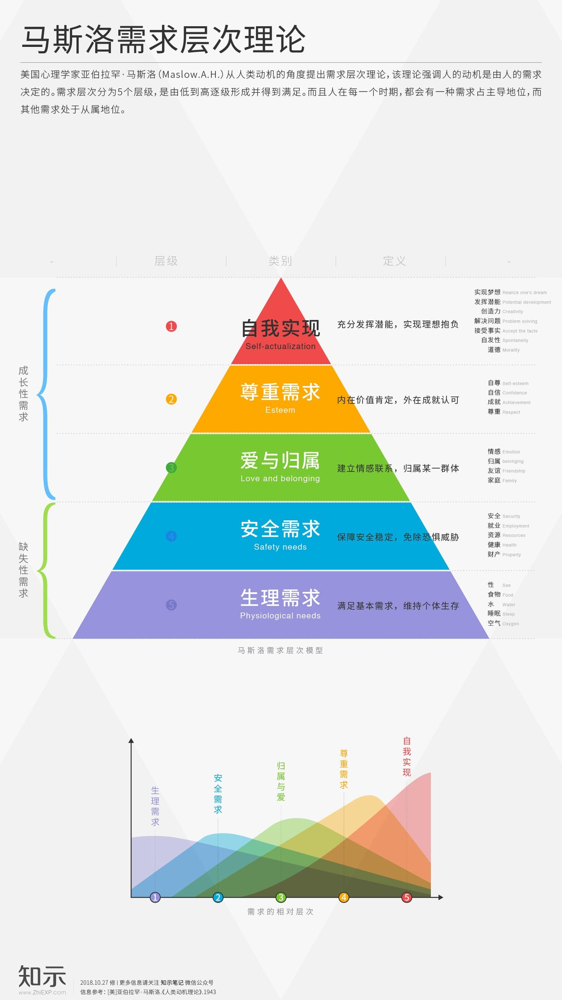

# 人的需求

## 生理:食物、水、空气
- 饥饿的人，会去偷窃、抢劫
- 失去住所的人，会成为“钉子户”

## 安全:生命、资产
- 持刀的人，会被警方制服
- 犯罪行为会被各方极力遏制

## 社会:亲友，爱人
- 没有亲友，会感到孤独
- 没有爱人，会感到烦躁、寂寞

## 尊重:成就、地位、晋升
- 贬低别人，获得一种优越感的提升，维持良好的自恋满足
- 努力工作，以获得口碑、地位
- 除非你想一辈子与对方为敌，否则即使是对方的行为举止让你忍无可忍，你也不应该对对方表露出轻蔑的态度

## 自我实现:超越自我、发挥潜能
- 不停的游戏，获取快感
- 不停攀登更高的山峰
- 不停的优化代码

