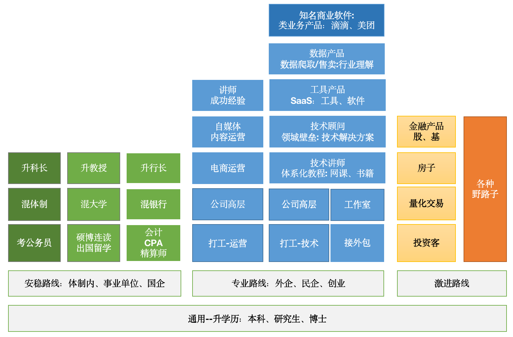

# 职业道路选择

工作几年后，看到身边有人离职读研考公，走向安稳；有人辞职创业，自己开始一番波折；也有人上班摸鱼，副业风生水起；你可能会对自己未来的职业规划产生困惑；那自己到底想做什么？自己适合做什么？下面，我把人的职业道路分成三种

## 职业道路
### 1. 安稳路线
自己学校/条件还不错，受家里长辈影响，毕业后顺利进入政府、事业单位、央企国企银行工作，在里面持续工作升级；
或者工作几年受够了社会企业的变动、求职&离职、职场政治、同事勾心斗角，想安稳、不再想过于劳心费力的生活，进入体制内寻求安稳。

### 2. 专业路线
毕业后凭借自己的个人能力进入企业、几年之后摸清行业的脉络，开始自己工作室、创业，最终凭一技之长在某个领域落脚，向社会输出产品&服务，并以此在社会立足

### 3. 激进路线
不甘于体制内的条条框框，也不忍寂寞打磨自己的专业能力，那就只能开始一条更为激进的路线
直接创业、投资等等，可能大富大贵也可能穷困潦倒

## 职业选择
### 思维注意：
1. 不要希望做一行做到底
2. 不要希望财务自由
3. 每一行有每一行的玩法
4. 个人发展，机遇和实力都不可缺
5. 分清自己是懒，还是不喜欢这份工作

### 职业选择：
1. 家里有对应的资源，进入这个行业
2. 一穷二白，选择自我和时代（互联网，科技公司，未来有前景的公司，垄断公司，金融）
3. 术业有专攻，任何行业到了中上层都一样，（实业，经济资本，政治）
4. 体制能还是体制外（家庭在体制内，就在体制内，体制内更需要更高的能力）
5. 出国还是读研还是就业
6. 工作后，发现不适合自己，很焦虑迷茫
7. 工作中，如何才能实现我想实现的状态（稳定？发展？人脉？金钱？背景？）

### 关于自由：
不是每天做自己想做的，出国旅游，不工作，玩，放飞自我。你以为的自由很可能就是别人的陷阱。
而是一辈子都走在探索人生道路上，对更高层次人生和玩法的追求，不被别人束缚和左右。

## 工作策略
### H = 3X + 4Y（厚积薄发的H点）
- X：公司客观条件
- x1: 公司大小地位
- x2: 公司里优秀人才多不多
- x3: 公司是否愿意让你接触更多的模块，还是必须靠很强的能动性才能了解

### Y：个人自身能力
- y1:主动性，是不是愿意主动了解其他模块
- y2:情商是不是很容易提高
- y3:对社会的认知，能不能尽快跟上自己的年龄
- y4:自我战略意思，能不能看的更远

